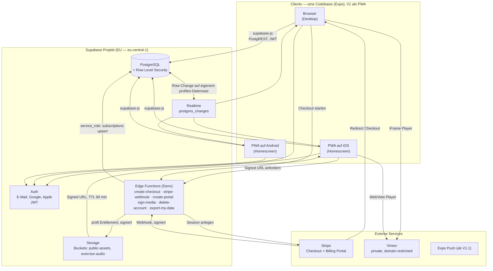
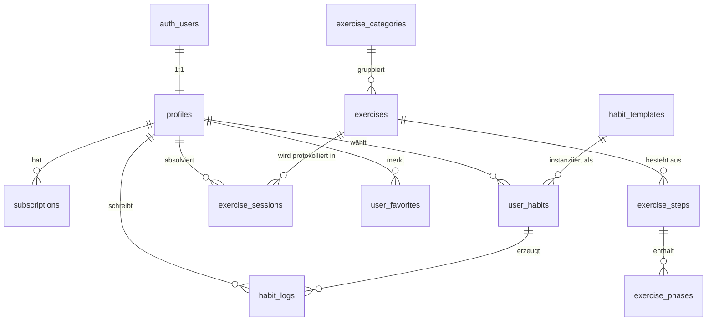
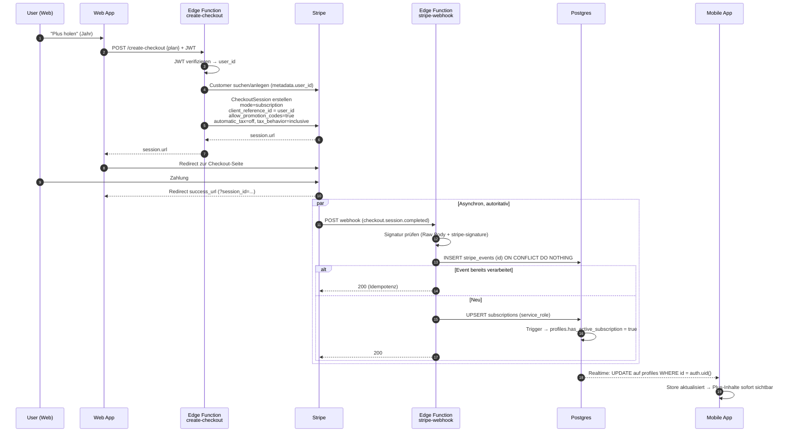

# System Architecture Document (SAD) — Atem-App MVP

**Projekt:** TheHaCode Breathwork App
**Version:** 0.6 (vereinfacht: statisch, kein Trial, kein Lifetime, nur Töne)
**Datum:** 26.07.2026
**Team:** 2 Personen, Teilzeit, **20 Std./Woche gemeinsam**, KI-gestützte Entwicklung
**Leitprinzip:** *Boring Technology.* Jede Komponente, die kein Kundenproblem löst, ist Wartungslast.

## Was V1 ist — und was nicht

**V1 besteht aus drei Dingen — und ersetzt die bestehende Website:**

1. **Landing Page mit News** — öffentlich, ohne Anmeldung; übernimmt „Über mich", Angebot und Kontakt von der alten Homepage
2. **Vorkonfigurierte Box-Sequenzen und Videos** — kostenlos, dauerhaft
3. **Der Sequenz-Konfigurator** — die bezahlte Funktion: eigene Box-Atemsequenzen bauen, mit Musik und gesprochener Anleitung

**Alles andere ist verschoben** (§11): Atem-Tagebuch und Micro Habits nach V1.1 · geführte Aufnahmen mit Marker-Synchronisation nach V1.2 · Session-Protokoll nach V1.1 · Programme, Coach-Sicht, native Apps, Offline nach V2.

**Neu in 0.6 gegenüber 0.5:** Homepage wird ersetzt, SEO nachrangig → statischer Export statt Serverrendern (§2.5) · kein Testzeitraum, Zugriff heißt bezahlt (§4.6) · kein Lifetime-Tarif · nur synthetische Töne, keine Musik und keine Sprachaufnahmen (§7.5) · Aufwand rund 130–165 Stunden statt 150–190 (§12.1).

**Aus 0.4:** Die bezahlte Leistung ist erstmals eine *Fähigkeit*, kein Inhalt — das verlagert die Zugriffsprüfung vom Lesen aufs Schreiben (§3.4) · Gesundheitsdaten nach Art. 9 DSGVO entfallen in V1 vollständig (§5) · die Engine braucht nur noch den Timer-Modus mit Cue-Samples (§7) · Kostenuntergrenze nahe null (§2.3) · Sprintplan für 20 Std./Woche (§12) · Arbeitsmodell für zwei KI-gestützte Entwickler (§13) · Bewertung der Homepage-Ablösung (§2.4).

---

## 0. Stack Lock-in (verbindlich)

> **Verbindlichkeit:** Diese Auswahl gilt ab sofort als gesetzt. Ein Wechsel von Framework, State Management, Styling oder BaaS findet im Projektverlauf nicht mehr statt. Neue Bibliotheken werden nur ergänzt, wenn sie eine Lücke schließen, die keine der hier gelisteten Komponenten abdeckt. Für ein 2-Personen-Teilzeit-Team ist Stack-Stabilität wertvoller als jede einzelne Optimierung.

> **Auslieferung V1: Progressive Web App.** Web und Mobile werden über eine installierbare PWA bedient, nicht über App Store und Play Store. Der Stack bleibt davon unberührt — dieselbe Expo-Codebasis exportiert in V2 die nativen Builds, ohne dass Code neu geschrieben wird. Begründung: §12.1.

### 0.1 Der Stack

| Ebene | Festlegung | Begründung |
|---|---|---|
| **Sprache** | TypeScript (`strict: true`) | Ein Typsystem über Client, Edge Functions und generierte DB-Typen |
| **Framework** | **React Native + Expo (SDK 53+), Expo Router** | V1 als Web-Export/PWA, V2 iOS + Android aus derselben Codebasis; deutlich bessere KI-Assistenz-Qualität als Flutter/Dart |
| **Auslieferung V1** | **PWA, statischer Export** (`web.output: 'static'`), Manifest, Icons, Service Worker | Inhalte kommen zur Laufzeit aus Supabase — statische Hülle heißt nicht statische Daten (§2.5) |
| **Server State** | **TanStack Query v5** | Caching, Retry, Loading-/Error-States als Standard; `persistQueryClient` ist der Einstiegspunkt für V2-Offline |
| **Client State** | **Zustand** | Session, Player-Zustand, UI-Präferenzen — minimal, ohne Boilerplate |
| **Styling** | **NativeWind v4** (Tailwind für RN) + zentrale `tokens.ts` | Utility-Klassen auf allen Plattformen; Tokens zusätzlich als TS-Objekt, weil Reanimated keine Klassen lesen kann |
| **Animation** | **React Native Reanimated 3** (UI-Thread) + `react-native-svg` | Atem-Animation läuft ohne JS-Bridge, auch unter Last flüssig |
| **Audio** | **Web Audio API** mit getrennten Gain-Nodes (Cue-Stimme / Musik) | Zwei Spuren, unabhängig regelbar, nahtloses Musik-Looping (§7.6) |
| **Haptik** | Vibration API, wo verfügbar | Phasenwechsel als zusätzlicher Kanal |
| **Formulare** | React Hook Form + Zod | Zod-Schemas werden zusätzlich in Edge Functions wiederverwendet |
| **i18n** | i18next + `expo-localization` | V1 nur Deutsch, Englisch mittelfristig geplant (§3.11) |
| **BaaS** | **Supabase** (Postgres, Auth, Storage, Edge Functions), Region EU | Begründung in §9 |
| **Payment** | **Stripe Checkout + Billing Portal**, nur Web, Promotion Codes aktiv | Keine IAP-Komplexität; Rabattcodes ohne eigenen Code (§4.6) |
| **Web-Hosting** | **Hostinger Business** — Node.js Web App, GitHub-Integration, statisch ausgeliefert | Kein Serverprozess, kein Einstiegspunkt, nichts das abstürzen kann (§2.5) |
| **Mobile-Build** | EAS Build + EAS Update — **erst in V2** | Entfällt in V1 vollständig |
| **Tests** | **Vitest** (Logik) · React Native Testing Library (Komponenten) · **pgTAP** (DB-Trigger/RLS) | §8 |
| **Video** | Vimeo, privat + Domain-Restriktion | Kein Branding, DSGVO-freundlicher als YouTube |
| **Fehler-Monitoring** | Sentry (EU-Datenregion), ohne Gesundheitsdaten im Payload | §5.6 |

### 0.2 Architektur-Entscheidungen auf einen Blick

| # | Entscheidung | Kernbegründung |
|---|---|---|
| 1 | Kein eigener API-Layer — Client spricht via PostgREST direkt mit Postgres | Autorisierung existiert nur an *einer* Stelle: RLS |
| 2 | Privilegierte Logik ausschließlich in 6 Edge Functions | Einziger Ort mit `service_role`-Key |
| 3 | Box-Phasen 2-stufig: `exercise_steps` (Wiederholungen) → `exercise_phases` | Deckt Box Breathing *und* High-Frequency/Retention-Protokolle ab |
| 4 | **Die bezahlte Leistung ist eine Fähigkeit, kein Inhalt:** Plus darf eigene Sequenzen anlegen | Zugriffsprüfung sitzt am INSERT, nicht am SELECT (§3.4) |
| 6 | **Kein Testzeitraum.** Zugriff heißt bezahlt — ein Boolean, ein Ort | Der Konfigurator ist auch ohne Konto bedienbar, nur Speichern ist gesperrt. Das ersetzt den Trial (§4.6) |
| 7 | **Nur Töne, keine Sprache, keine Musik** | Musik bringt der Nutzer selbst mit; Töne kommen aus dem Oszillator (§7.5) |
| 8 | Zwei getrennte Supabase-Projekte + Stripe Test/Live | Keine Mandantentrennung per Flag |
| 9 | UUID-PKs, `updated_at`, Soft-Delete, `client_id` ab Tag 1 | V2-Offline-Sync ohne Schema-Migration der Nutzdaten |
| 10 | Player-Logik als reine Funktionen, getrennt von der Render-Schicht | Timer-Präzision ist testbar (§8.1) |
| 11 | Admin-Rolle und Schreib-Policies ab Tag 1, Admin-UI erst später | Nachträglich wäre es ein Sicherheitsumbau, jetzt ist es eine Migration (§3.8) |
| 12 | Keine Gesundheitsdaten in V1 | Das Tagebuch kommt in V1.1 — bis dahin entfällt die Art.-9-Last vollständig (§5) |
| 13 | **Migrationen sind ausnahmslos additiv** | Hostinger deployt bei jedem Push selbstständig; die Reihenfolge Datenbank-vor-App ist damit nicht erzwingbar (§2.6) |
| 14 | `service_role` bleibt in Supabase Edge Functions, nicht auf dem Webserver | Der gefährlichste Schlüssel gehört so nah wie möglich an die Datenbank, nicht auf ein Shared Hosting (§13) |

---

## 1. High-Level Architektur

### 1.1 Komponentendiagramm



### 1.2 Datenflüsse in Worten

**Lesepfad (99 % aller Requests):**
Client → `supabase-js` → PostgREST → Postgres. **Kein eigener API-Layer.** Autorisierung passiert ausschließlich über RLS-Policies, die gegen `auth.uid()` und das Plus-Entitlement prüfen. Damit gibt es keinen zweiten Ort, an dem Berechtigungslogik driften kann — der wichtigste Wartungsvorteil für ein 2-Personen-Team.

**Schreibpfad (User-Daten):** identisch — Insert/Update direkt in `habit_logs`, `exercise_sessions`, `user_habits`, abgesichert per RLS.

**Privilegierter Pfad (nur 6 Edge Functions):** alles, was ein Secret braucht oder RLS umgehen muss — Stripe-Kommunikation, Webhook-Verarbeitung, Signieren von Plus-Audios sowie die beiden DSGVO-Routinen `delete-account` und `export-my-data`. Diese Functions sind die einzige Stelle mit `service_role`-Key.

**Medien:** Videos liegen komplett außerhalb (Vimeo), Audios im Supabase Storage. Free-Audios im Public Bucket (CDN-cached, keine Function nötig), Plus-Audios im Private Bucket über `sign-media`. Die fünf bis sechs Hintergrundmusik-Tracks liegen öffentlich und werden vom Service Worker dauerhaft gecacht — sie sind bei jeder Session dieselben Dateien und damit der wirksamste Hebel gegen den einzigen Kostenposten, der mit der Nutzerzahl mitwächst.

**Admin:** kein eigenes Admin-Frontend im MVP. Übungen, Phasen und Habit-Vorlagen werden über das Supabase Studio bzw. per SQL-Seed gepflegt. Ein Admin-UI ist bewusst Post-MVP — es ist der teuerste Feature-Block ohne direkten Nutzerwert.

---

## 2. Umgebungen, Deployment & CI/CD

### 2.1 Strikte Trennung

| Ressource | Staging | Production |
|---|---|---|
| Supabase | Projekt `thehacode-staging` (Free/Pro) | Projekt `thehacode-prod` (Pro, EU) |
| Stripe | Test-Mode, eigene Preise/Webhook-Secret | Live-Mode |
| Web-Hosting | Hostinger Node.js Web App, Branch `develop`, `staging.` Subdomain | Hostinger Node.js Web App, Branch `main`, `app.` auf der Bestandsdomain |
| Mobile | — (V1 ist PWA, gleiche Deployments) | — |
| Vimeo | gleiche Videos, Domain-Whitelist enthält beide Domains | — |

> **Domain:** Die bestehende Website bleibt unangetastet auf der Hauptdomain — sie trägt die SEO und den Coaching-Funnel. Die App wohnt auf `app.deine-domain.at`. Für Supabase Auth und Stripe-Redirects ist das der einfachste Fall: eine Origin, eine Cookie-Domain, kein Cross-Site-Thema.

> **Regel:** Keine gemeinsame Datenbank mit `is_test`-Flag. Zwei Projekte kosten wenige Euro, ein vermischter Datenbestand kostet ein Wochenende.

### 2.2 Migrations- und Release-Flow

```
feature/*  ──PR──►  develop  ──►  CI grün  ──►  Supabase Staging  ──►  Hostinger Staging
                                                                            │
                                                                    Smoke-Tests gegen
                                                                    staging.domain.at
                                                                            │
                                                                        grün │
                                                                            ▼
                       main  ◄── automatischer Merge ── (optional ein Klick Freigabe)
                         │
                         └──►  Supabase Production  ──►  Hostinger Production  ──►  Smoke-Tests
```

Zwei Dinge geschehen dabei **außerhalb** von GitHub Actions: Hostinger beobachtet die Branches selbst und baut nach jedem Push automatisch. Die CI stößt das Deployment also nicht an, sondern *wartet darauf* und prüft danach.

* **Schema ausschließlich als Migrations-Dateien** (`supabase/migrations/*.sql`) im Repo. Kein manuelles Klicken im Studio auf Prod — jede Änderung wird auf Staging getestet und dann identisch ausgerollt.
* **Seed-Daten** (Übungen, Habit-Vorlagen) als versionierte SQL-Seeds, damit Staging jederzeit reproduzierbar ist.
* **GitHub Actions Jobs:** `lint + typecheck` → `vitest run` → `supabase db lint` → `pgTAP` → `db push` (Zielumgebung nach Branch) → `supabase functions deploy` → auf Hostinger-Deployment warten → Smoke-Tests.
* **Secrets** ausschließlich in GitHub Environments + Supabase Function Secrets. Der `service_role`-Key existiert nie im Client-Bundle.

### 2.3 Kosten

| Posten | V1 (vor Umsatz) | Ab erstem zahlenden Kunden |
|---|---|---|
| Hostinger Business (Staging + Production) | ~4–8 EUR/Monat, ein Tarif trägt beide Websites | gleich |
| Supabase Production | Free-Tier: 0 | Pro, ~25 USD |
| Supabase Staging | Free-Tier: 0 | Free-Tier: 0 |
| Videohosting | 0 (in V1 verzichtbar) | Bunny Stream, ~1–5 EUR |
| Domain | bereits vorhanden | — |
| Stripe | keine Grundgebühr | ~1,5 % + 0,25 EUR je EU-Kartenzahlung |
| **Summe monatlich** | **≈ 5–8 EUR** | **≈ 35 EUR** |

**Ein Hostinger-Tarif trägt beide Umgebungen.** Business erlaubt mehrere Websites; Staging läuft auf einer Subdomain, Production auf `app.`. Das ist der wesentliche Kostenvorteil gegenüber getrennten Hosting-Verträgen — mit der Einschränkung, dass sich beide dieselben CPU- und RAM-Grenzen teilen. Für ein Testsystem, das nur zwei Personen benutzen, ist das unkritisch; das Ressourcen-Diagramm im hPanel zeigt es notfalls früh genug an.

**Supabase Free bis zum ersten Umsatz.** 500 MB Datenbank und 1 GB Storage reichen für Landing Page, News, Übungsdefinitionen und Musiktracks mühelos. Was fehlt, sind tägliche Backups und Point-in-Time-Recovery. **Der Tag der ersten Zahlung ist der Tag des Upgrades** — ab da existieren Kundendaten und Zahlungsbezüge.

**Video ist in V1 optional.** Der Free-Bereich ist mit vorkonfigurierten Sequenzen vollständig; Videos später über Bunny Stream.

### 2.4 Die Homepage wird ersetzt

Entschieden: Die App übernimmt die Hauptdomain, die alte Website wird abgelöst. Ein System statt zwei.

**Das SEO-Risiko ist bewusst in Kauf genommen** — die bestehende Seite hat noch wenig Reichweite, der mögliche Verlust ist entsprechend klein. Genau diese Entscheidung erlaubt den statischen Export und damit den Wegfall des gesamten Serverteils (§2.5).

**Was von der alten Seite übernommen wird:** „Über mich", Angebot und Kontakt. Sie liegen als gepinnte Beiträge in `news_posts` statt in einer eigenen Seitenstruktur — vier Inhalte rechtfertigen kein zweites Modell.

**Reihenfolge:** Die App startet in Block 1 auf `app.deine-domain.at`, die alte Seite bleibt unangetastet. Erst in Block 6, wenn die App trägt, wandert sie auf die Hauptdomain — mit 301-Weiterleitungen für jede bestehende URL. Vorher bleibt die alte Seite als Sicherheitsnetz stehen.

### 2.5 Hostinger — statische Auslieferung

Ursprünglich war serverseitiges Rendern vorgesehen, aus zwei Gründen: Suchmaschinen und die sofortige Veröffentlichung neuer News. **Beide Gründe sind entfallen.**

SEO ist nachrangig, weil die bestehende Seite noch wenig Reichweite hat und ohnehin abgelöst wird. Und der zweite Grund war ein Denkfehler meinerseits: Bei einem statischen Export ist nur die **Hülle** statisch. News werden zur Laufzeit aus Supabase geladen, genau wie Übungen und eigene Sequenzen. Ein Beitrag, der im Studio veröffentlicht wird, ist sofort sichtbar — ohne Neubau, ohne Auslöser, ohne Zusatzmechanik.

Damit entfällt der gesamte Serverteil: kein Express, kein Einstiegspunkt, kein Prozess, der abstürzen oder neu gestartet werden kann. Und mit ihm der Spike, der bis eben das größte offene Risiko des Projekts war.

**Einstellungen in hPanel:**

| Feld | Wert |
|---|---|
| Website-Typ | Node.js Web App |
| Framework | „Other" |
| Node-Version | 22.x |
| Build-Befehl | `npm ci && npm run build:web` |
| Output-Verzeichnis | `dist` |
| Entry-File | *leer lassen* |

> **Die Tür bleibt offen.** Wird SEO später wichtig, ist der Weg zurück eine Konfigurationszeile (`web.output` auf `server`) plus ein etwa dreißigzeiliger Express-Einstiegspunkt. Nichts an der Anwendung ändert sich dabei. Diese Entscheidung ist reversibel und muss jetzt nicht perfekt sein.

### 2.6 Warum Migrationen ausnahmslos additiv sein müssen

Hostinger beobachtet den Branch selbst und baut nach jedem Push automatisch. **Die Reihenfolge „erst Datenbank, dann App" ist damit nicht erzwingbar** — die GitHub-Action mit `supabase db push` und Hostingers Build starten gleichzeitig, und wer zuerst fertig ist, entscheidet der Zufall.

Daraus folgt eine Regel, die in diesem Setup keine gute Praxis ist, sondern eine Bedingung:

* **Nur hinzufügen, nie entfernen oder umbenennen.** Neue Spalten sind `nullable` oder haben ein Default.
* **Alte App-Version muss mit neuem Schema laufen** und neue App-Version mit altem Schema. Für die wenigen Minuten Überlappung reicht das.
* **Umbenennen wird zu drei Schritten** über zwei Releases: neue Spalte anlegen und doppelt schreiben, dann Lesen umstellen, im übernächsten Release die alte Spalte entfernen.
* Der Job `supabase db lint` in der CI meldet zerstörerische Änderungen; ein `drop column` in einem PR ist ein Gesprächsanlass, kein Merge.

## 3. Datenbank-Schema

### 3.1 ER-Übersicht



### 3.2 Enums und Grundlagen

```sql
-- ---------- Extensions ----------
create extension if not exists "pgcrypto";       -- gen_random_uuid()

-- ---------- Enums ----------
create type visibility_level     as enum ('free', 'registered', 'plus');
create type exercise_type        as enum ('paced', 'general');   -- Typ A / Typ B
create type playback_mode        as enum ('timer', 'audio_guided', 'audio_only');
create type phase_kind           as enum ('inhale', 'hold_in', 'exhale', 'hold_out', 'free_breathing');
create type habit_tracking_type  as enum ('number', 'smiley_5', 'slider_100', 'text');
create type subscription_plan    as enum ('monthly', 'yearly');
create type subscription_status  as enum ('active','trialing','past_due','canceled','incomplete','expired');

-- ---------- Utility: updated_at ----------
create or replace function public.set_updated_at()
returns trigger language plpgsql as $$
begin
  new.updated_at = now();
  return new;
end $$;
```

### 3.3 Users / Profiles

`auth.users` gehört Supabase. Alles Fachliche liegt in `public.profiles` (1:1, gleiche ID).

```sql
create table public.profiles (
  id                      uuid primary key references auth.users(id) on delete cascade,
  display_name            text,
  avatar_url              text,
  locale                  text        not null default 'de',
  timezone                text        not null default 'Europe/Vienna',

  -- Der EINZIGE Zugriffswert, ausschließlich vom Stripe-Trigger gesetzt
  has_active_subscription boolean     not null default false,
  plus_until              timestamptz,

  -- Töne beim Phasenwechsel, geräteübergreifend gemerkt
  sound_enabled           boolean     not null default true,

  onboarding_completed_at timestamptz,
  registered_at           timestamptz not null default now(),
  created_at              timestamptz not null default now(),
  updated_at              timestamptz not null default now()
);

create trigger trg_profiles_updated
  before update on public.profiles
  for each row execute function public.set_updated_at();

-- Profil automatisch beim Signup anlegen (gilt für E-Mail, Google und Apple gleichermaßen)
create or replace function public.handle_new_user()
returns trigger language plpgsql security definer set search_path = public as $$
begin
  insert into public.profiles (id, display_name, avatar_url)
  values (
    new.id,
    coalesce(new.raw_user_meta_data->>'full_name', new.raw_user_meta_data->>'name'),
    new.raw_user_meta_data->>'avatar_url'
  )
  on conflict (id) do nothing;
  return new;
end $$;

create trigger on_auth_user_created
  after insert on auth.users
  for each row execute function public.handle_new_user();
```

> **Auth-Provider:** bewusst *keine* eigene Spalte. Supabase führt die Provider in `auth.identities` — ein User kann E-Mail *und* Google *und* Apple verknüpft haben. Eine einzelne `auth_provider`-Spalte wäre bereits am Tag des ersten Account-Linkings falsch. Für Anzeigezwecke reicht eine View auf `auth.identities`.

**Eine Zugriffsentscheidung, ein Ort.** Es gibt keinen Testzeitraum: Zugriff heißt bezahlt. Alle Policies fragen trotzdem eine Funktion statt der Spalte — das kostet eine Zeile Indirektion und erspart später einen Umbau:

```sql
-- Die einzige Zugriffsentscheidung. RLS und App fragen ausschließlich sie,
-- niemals die Spalte direkt. Käme später eine Aktion, ein Gutschein oder doch
-- ein Testzeitraum dazu, ändert sich genau diese Funktion — und keine Policy.
create or replace function public.has_plus_access()
returns boolean language sql stable security definer set search_path = public as $$
  select coalesce(
    (select p.has_active_subscription from public.profiles p where p.id = auth.uid()),
    false
  );
$$;
```

---

### 3.4 Exercises — inkl. Modellierung der Box-Atmung

Das Kernproblem: eine Atemübung ist eine *verschachtelte, wiederholte Sequenz*. Box Breathing ist dabei der einfachste Fall (ein Block, 4 Phasen, N Runden). Wim-Hof-artige High-Frequency-Protokolle brauchen mehrere Blöcke mit unterschiedlicher Wiederholungszahl (30 schnelle Atemzüge → Retention „so lange wie möglich" → Recovery-Hold 15 s → das Ganze 3×).

**Empfohlenes Modell: zwei Ebenen.**

```
exercise
 └── exercise_step   (position, repeat_count)      ← „Block", wiederholt sich N-mal
      └── exercise_phase (position, kind, duration) ← einzelne Atemphase
```

Box Breathing = *ein* Step mit `repeat_count = 8` und 4 Phasen. Das flache Modell ist also nur der Spezialfall — für wenige zusätzliche Zeilen Code bekommt man die gesamte Technik-Bandbreite. Der Alternativvorschlag, die Phasen als JSONB in `exercises` abzulegen, ist bewusst verworfen: die Phasen sind Redaktionsdaten, die im Studio editiert, validiert und später ausgewertet werden sollen — JSONB verliert Constraints, Referenzintegrität und Diff-Barkeit.

```sql
create table public.exercise_categories (
  id          uuid primary key default gen_random_uuid(),
  slug        text not null unique,
  title       text not null,
  description text,
  icon        text,
  sort_order  int  not null default 0
);

create table public.exercises (
  id                    uuid primary key default gen_random_uuid(),
  slug                  text unique,   -- null bei Nutzer-Sequenzen
  category_id           uuid references public.exercise_categories(id) on delete set null,

  -- NULL = redaktionell (Admin), gesetzt = vom Nutzer selbst gebaut.
  -- Ein Feld statt zweier Tabellenbäume: die Engine kennt nur einen Codepfad.
  owner_id              uuid references auth.users(id) on delete cascade,

  type                  exercise_type    not null,
  playback_mode         playback_mode    not null default 'timer',
  visibility            visibility_level not null default 'plus',

  title                 text not null,
  subtitle              text,
  description_md        text,
  benefits_md           text,
  contraindications_md  text,          -- fachlich relevant: Schwangerschaft, Epilepsie, Herz

  -- Medien
  cover_image_path      text,          -- Storage: public-assets
  audio_path            text,          -- Storage: exercise-audio (privat bei visibility='plus')
  video_provider        text check (video_provider in ('vimeo','youtube')),
  video_external_id     text,
  video_hash            text,          -- Vimeo Private-Link-Hash

  -- Nur für type = 'paced'
  default_round_count   int check (default_round_count between 1 and 200),
  has_metronome         boolean not null default true,

  difficulty            int check (difficulty between 1 and 3),
  estimated_seconds     int,           -- vorberechnet, siehe View unten
  sort_order            int not null default 0,
  is_published          boolean not null default false,

  created_at            timestamptz not null default now(),
  updated_at            timestamptz not null default now(),

  -- Integritätsregeln je Typ
  constraint chk_paced_needs_rounds
    check (type <> 'paced' or default_round_count is not null),
  constraint chk_general_needs_content
    check (type <> 'general' or (description_md is not null or audio_path is not null or video_external_id is not null)),
  -- Geführte Aufnahmen brauchen zwingend eine Audiodatei als Zeitquelle (§7.2)
  constraint chk_audio_modes_need_audio
    check (playback_mode = 'timer' or audio_path is not null)
);

create index on public.exercises (visibility) where is_published;
create index on public.exercises (category_id);
```

**Die drei Wiedergabemodi** entscheiden, was die Engine als Zeitquelle nimmt:

| `playback_mode` | Zeitquelle | Animation | Typischer Inhalt |
|---|---|---|---|
| `timer` | Ankeruhr in der App | ja, aus den DB-Phasen | Box Breathing, 4-7-8, Kohärenzatmung |
| `audio_guided` | **Position der Stimmspur** | ja, Phasen als Marker auf der Aufnahme | „Ich zähle dich durch" — geführte Sessions |
| `audio_only` | Audioplayer | nein | Erklärungen, Meditationen über freier Atmung |

Bei `audio_guided` sind die Phasendauern keine freien Parameter mehr, sondern müssen zur Aufnahme passen. Gesetzt werden sie mit dem Marker-Werkzeug — **das kommt erst in V1.2** (§11.3). V1 nutzt ausschließlich `timer`, ergänzt um Cue-Samples (§7.5).

#### Der Sequenz-Konfigurator — die bezahlte Funktion

In V1 verkauft ihr keinen Inhalt, sondern eine Fähigkeit. Das verschiebt die Zugriffsprüfung an eine ungewohnte Stelle: **Sie sitzt am `INSERT`, nicht am `SELECT`.**

```sql
-- Redaktionelle Inhalte: sichtbar nach Stufe. Eigene Sequenzen: immer die eigenen.
create policy exercises_read on public.exercises
  for select using (
    (owner_id is null and is_published and (
        visibility = 'free'
        or (visibility = 'registered' and auth.uid() is not null)
        or (visibility = 'plus'       and public.has_plus_access())
    ))
    or owner_id = auth.uid()
  );

-- Anlegen eigener Sequenzen: NUR mit Plus-Zugriff. Das ist das Produkt.
create policy exercises_insert_own on public.exercises
  for insert with check (
    owner_id = auth.uid()
    and public.has_plus_access()
    and type = 'paced'            -- Nutzer bauen Sequenzen, keine Videobeiträge
    and playback_mode = 'timer'
    and visibility = 'plus'
    and not is_published          -- eigene Sequenzen erscheinen nie im Katalog
  );

create policy exercises_update_own on public.exercises
  for update using (owner_id = auth.uid() and public.has_plus_access())
          with check (owner_id = auth.uid());

-- Löschen bleibt IMMER erlaubt — auch nach Trial-Ende.
create policy exercises_delete_own on public.exercises
  for delete using (owner_id = auth.uid());
```

> **Dieselbe Regel wie beim Tagebuch, aus demselben Grund:** Nach Ablauf des Trials bleiben die eigenen Sequenzen **lesbar und abspielbar**, nur Anlegen und Ändern sind gesperrt. Wer sich seine 4-7-8-Sequenz gebaut hat, verliert sie nicht — er kann sie nur nicht mehr verändern. Das ist der Unterschied zwischen einer Paywall und einer Geiselnahme, und er entscheidet darüber, ob jemand nach einer Pause zurückkommt.

Für die Kindtabellen gilt dieselbe Logik. Weil ihre Policies über die Unterabfrage auf `exercises` laufen, erben sie das Verhalten automatisch — der Schreibzugriff braucht aber eine eigene Regel:

```sql
create policy steps_write_own on public.exercise_steps
  for all using (exists (
    select 1 from public.exercises e
    where e.id = exercise_id and e.owner_id = auth.uid()
  )) with check (exists (
    select 1 from public.exercises e
    where e.id = exercise_id and e.owner_id = auth.uid() and public.has_plus_access()
  ));
```

Ein Mengenlimit gehört ebenfalls in die Datenbank, nicht ins UI:

```sql
create or replace function public.check_exercise_quota()
returns trigger language plpgsql security definer set search_path = public as $$
begin
  if new.owner_id is not null
     and (select count(*) from public.exercises where owner_id = new.owner_id) >= 50 then
    raise exception 'Maximal 50 eigene Sequenzen';
  end if;
  return new;
end $$;

create trigger trg_exercise_quota
  before insert on public.exercises
  for each row execute function public.check_exercise_quota();
```

```sql
create table public.exercise_steps (
  id            uuid primary key default gen_random_uuid(),
  exercise_id   uuid not null references public.exercises(id) on delete cascade,
  position      int  not null,
  label         text,                                   -- z. B. "Aufwärmen", "Retention"
  repeat_count  int  not null default 1 check (repeat_count between 1 and 200),
  rest_seconds  numeric(5,2) not null default 0,        -- Pause nach dem Block
  unique (exercise_id, position)
);

create table public.exercise_phases (
  id                        uuid primary key default gen_random_uuid(),
  step_id                   uuid not null references public.exercise_steps(id) on delete cascade,
  position                  int  not null,
  kind                      phase_kind   not null,
  duration_seconds          numeric(5,2) not null default 0 check (duration_seconds >= 0),

  -- „So lange du kannst" (Retention): Client zeigt Stoppuhr, User beendet per Tap
  is_open_ended             boolean not null default false,

  -- Progression über die Runden hinweg (z. B. Ausatmung wird pro Runde 0,5 s länger)
  duration_delta_per_round  numeric(4,2) not null default 0,
  max_duration_seconds      numeric(5,2),

  cue_text                  text,                       -- "durch die Nase, in den Bauch"
  unique (step_id, position),

  constraint chk_open_ended_has_no_fixed_duration
    check (not is_open_ended or duration_seconds = 0)
);
```

**Beispiel-Seed — Box Breathing 4-4-4-4, 8 Runden:**

```sql
with e as (
  insert into public.exercises (slug, type, visibility, title, default_round_count, is_published)
  values ('box-breathing-4444', 'paced', 'free', 'Box Breathing 4-4-4-4', 8, true)
  returning id
), s as (
  insert into public.exercise_steps (exercise_id, position, label, repeat_count)
  select id, 1, 'Zyklus', 8 from e
  returning id
)
insert into public.exercise_phases (step_id, position, kind, duration_seconds, cue_text)
select s.id, v.pos, v.kind::phase_kind, v.dur, v.cue
from s, (values
  (1,'inhale',   4, 'Ruhig durch die Nase einatmen'),
  (2,'hold_in',  4, 'Halten, Schultern locker'),
  (3,'exhale',   4, 'Langsam ausatmen'),
  (4,'hold_out', 4, 'Leer halten')
) as v(pos, kind, dur, cue);
```

**Gesamtdauer als View** (der Client muss nichts rechnen, das Admin-UI später auch nicht):

```sql
create or replace view public.v_exercise_duration as
select
  e.id as exercise_id,
  sum(
    st.repeat_count * coalesce(ph.step_seconds, 0) + st.rest_seconds
  )::int as total_seconds
from public.exercises e
join public.exercise_steps st on st.exercise_id = e.id
left join lateral (
  select sum(p.duration_seconds
             + p.duration_delta_per_round * (st.repeat_count - 1) / 2.0) as step_seconds
  from public.exercise_phases p
  where p.step_id = st.id
) ph on true
group by e.id;
```

> Bei `is_open_ended = true` ist die Dauer naturgemäß eine Schätzung — dafür kann optional `max_duration_seconds` als Planwert einfließen.

### 3.5 Micro Habits & Atem-Tagebuch

Drei Tabellen, klar getrennt: **Vorlage (Admin) → Auswahl des Users → Tageseintrag.**

```sql
-- 1) Vorlage, vom Admin gepflegt
create table public.habit_templates (
  id             uuid primary key default gen_random_uuid(),
  slug           text not null unique,
  title          text not null,
  description_md text,
  tracking_type  habit_tracking_type not null,
  visibility     visibility_level    not null default 'registered',

  unit           text,                    -- 'Sekunden' (BOLT), 'Stunden', 'Gläser'
  min_value      numeric,
  max_value      numeric,
  step_value     numeric,
  default_target numeric,
  higher_is_better boolean not null default true,   -- steuert Diagramm-Semantik

  icon           text,
  sort_order     int not null default 0,
  is_published   boolean not null default false,
  created_at     timestamptz not null default now(),
  updated_at     timestamptz not null default now()
);

-- 2) Der User abonniert eine Vorlage
create table public.user_habits (
  id           uuid primary key default gen_random_uuid(),
  user_id      uuid not null references auth.users(id) on delete cascade,
  template_id  uuid not null references public.habit_templates(id) on delete restrict,
  target_value numeric,
  sort_order   int not null default 0,
  is_active    boolean not null default true,
  started_on   date not null default current_date,
  archived_at  timestamptz,
  created_at   timestamptz not null default now(),
  updated_at   timestamptz not null default now()
);

-- Ein Habit nur einmal *aktiv* pro User; Re-Aktivierung nach Archivierung bleibt möglich
create unique index uq_user_habit_active
  on public.user_habits (user_id, template_id) where is_active;

-- 3) Der Tageseintrag
create table public.habit_logs (
  id             uuid primary key default gen_random_uuid(),
  user_id        uuid not null references auth.users(id) on delete cascade,  -- denormalisiert für RLS
  user_habit_id  uuid not null references public.user_habits(id) on delete cascade,
  log_date       date not null,

  value_numeric  numeric,      -- number | smiley_5 (1..5) | slider_100 (0..100)
  value_text     text,         -- tracking_type = 'text'
  note           text,

  created_at     timestamptz not null default now(),
  updated_at     timestamptz not null default now(),
  deleted_at     timestamptz,                       -- Soft-Delete, V2-Sync
  client_id      uuid,                              -- Idempotenz, V2-Sync

  unique (user_habit_id, log_date)
);

create unique index uq_habit_logs_client on public.habit_logs (user_id, client_id)
  where client_id is not null;
create index idx_habit_logs_user_date on public.habit_logs (user_id, log_date desc);
```

**Warum ein generisches Wertepaar statt vier Spalten oder JSONB?**
Alle drei numerischen Tracking-Typen (Zahl, 5-Smileys, Slider 0–100) sind mathematisch derselbe Typ und sollen dieselben Charts, Durchschnitte und Streak-Berechnungen füttern. Ein `numeric` + ein `text` decken alle vier Fälle ab; die Semantik liefert `habit_templates.tracking_type`. Validiert wird per Trigger, damit die Integrität trotzdem in der DB liegt:

```sql
create or replace function public.validate_habit_log()
returns trigger language plpgsql as $$
declare t habit_tracking_type; mn numeric; mx numeric;
begin
  select ht.tracking_type, ht.min_value, ht.max_value
    into t, mn, mx
  from public.user_habits uh
  join public.habit_templates ht on ht.id = uh.template_id
  where uh.id = new.user_habit_id;

  if t = 'text' then
    if new.value_text is null or length(new.value_text) = 0 then
      raise exception 'value_text erforderlich für tracking_type=text';
    end if;
    new.value_numeric := null;
  else
    if new.value_numeric is null then
      raise exception 'value_numeric erforderlich für tracking_type=%', t;
    end if;
    if t = 'smiley_5'   and new.value_numeric not between 1 and 5   then
      raise exception 'smiley_5 erwartet 1..5'; end if;
    if t = 'slider_100' and new.value_numeric not between 0 and 100 then
      raise exception 'slider_100 erwartet 0..100'; end if;
    if t = 'number' and mn is not null and new.value_numeric < mn then
      raise exception 'Wert unter Minimum'; end if;
    if t = 'number' and mx is not null and new.value_numeric > mx then
      raise exception 'Wert über Maximum'; end if;
  end if;
  return new;
end $$;

create trigger trg_validate_habit_log
  before insert or update on public.habit_logs
  for each row execute function public.validate_habit_log();
```

**Tagebuch-Abfrage für einen Tag** (ein Roundtrip, liefert auch noch nicht ausgefüllte Habits):

```sql
select uh.id as user_habit_id, ht.title, ht.tracking_type, ht.unit,
       hl.value_numeric, hl.value_text, hl.note
from public.user_habits uh
join public.habit_templates ht on ht.id = uh.template_id
left join public.habit_logs hl
       on hl.user_habit_id = uh.id
      and hl.log_date = $1
      and hl.deleted_at is null
where uh.user_id = auth.uid() and uh.is_active
order by uh.sort_order;
```

### 3.6 Übungs-Sessions & Favoriten

```sql
create table public.exercise_sessions (
  id                uuid primary key default gen_random_uuid(),
  user_id           uuid not null references auth.users(id) on delete cascade,
  exercise_id       uuid references public.exercises(id) on delete set null,
  started_at        timestamptz not null default now(),
  completed_at      timestamptz,
  duration_seconds  int check (duration_seconds >= 0),
  rounds_completed  int,
  is_completed      boolean not null default false,
  client_id         uuid,
  created_at        timestamptz not null default now(),
  updated_at        timestamptz not null default now(),
  deleted_at        timestamptz
);

create unique index uq_sessions_client on public.exercise_sessions (user_id, client_id)
  where client_id is not null;
create index idx_sessions_user_time on public.exercise_sessions (user_id, started_at desc);

create table public.user_favorites (
  user_id     uuid not null references auth.users(id) on delete cascade,
  exercise_id uuid not null references public.exercises(id) on delete cascade,
  created_at  timestamptz not null default now(),
  primary key (user_id, exercise_id)
);
```

### 3.7 Subscriptions & Stripe-Events

```sql
create table public.subscriptions (
  id                         uuid primary key default gen_random_uuid(),
  user_id                    uuid not null references auth.users(id) on delete cascade,

  provider                   text not null default 'stripe',   -- Raum für 'apple_iap' / 'google_play'
  stripe_customer_id         text,
  stripe_subscription_id     text unique,
  stripe_checkout_session_id text unique,

  plan                       subscription_plan   not null,
  status                     subscription_status not null,
  current_period_end         timestamptz not null,
  cancel_at_period_end       boolean not null default false,
  started_at                 timestamptz not null default now(),
  canceled_at                timestamptz,
  created_at                 timestamptz not null default now(),
  updated_at                 timestamptz not null default now()
);

create index idx_subs_user_active on public.subscriptions (user_id)
  where status in ('active','trialing');

-- Idempotenz-Register: jedes Stripe-Event genau einmal verarbeiten
create table public.stripe_events (
  id           text primary key,        -- evt_...
  type         text not null,
  received_at  timestamptz not null default now(),
  processed_at timestamptz,
  payload      jsonb
);
```

**Der Trigger, der das Entitlement setzt** — die einzige Stelle im System, die `has_active_subscription` schreibt:

```sql
create or replace function public.sync_profile_entitlement()
returns trigger language plpgsql security definer set search_path = public as $$
declare uid uuid := coalesce(new.user_id, old.user_id);
declare active boolean;
declare until  timestamptz;
begin
  select
    bool_or(s.status in ('active','trialing')
            and s.current_period_end > now()),
    max(s.current_period_end)
  into active, until
  from public.subscriptions s
  where s.user_id = uid;

  update public.profiles
     set has_active_subscription = coalesce(active, false),
         plus_until              = until,
         updated_at              = now()
   where id = uid;

  return null;
end $$;

create trigger trg_sync_entitlement
  after insert or update or delete on public.subscriptions
  for each row execute function public.sync_profile_entitlement();
```

> Für den Ablauf regulärer Abos ohne Stripe-Event (Netzwerkausfall o. ä.) läuft zusätzlich ein täglicher `pg_cron`-Job, der abgelaufene Perioden nachzieht. Gürtel und Hosenträger — kostet fünf Zeilen SQL.

### 3.8 Row Level Security — das Sicherheitsherzstück

```sql
alter table public.profiles           enable row level security;
alter table public.exercises          enable row level security;
alter table public.exercise_steps     enable row level security;
alter table public.exercise_phases    enable row level security;
alter table public.habit_templates    enable row level security;
alter table public.user_habits        enable row level security;
alter table public.habit_logs         enable row level security;
alter table public.exercise_sessions  enable row level security;
alter table public.user_favorites     enable row level security;
alter table public.subscriptions      enable row level security;

-- Hilfsfunktion: ist der aktuelle User Admin?
-- Die Rolle steht in app_metadata und ist damit vom Client NICHT manipulierbar.
create or replace function public.is_admin()
returns boolean language sql stable as $$
  select coalesce(
    (auth.jwt() -> 'app_metadata' ->> 'role') = 'admin',
    false
  );
$$;

-- Profil: nur das eigene, und Entitlement-Felder NIE vom Client schreibbar
create policy profiles_select_own on public.profiles
  for select using (id = auth.uid());
create policy profiles_update_own on public.profiles
  for update using (id = auth.uid()) with check (id = auth.uid());
revoke update (has_active_subscription, plus_until)
  on public.profiles from authenticated, anon;

-- Content: siehe §3.4 — exercises_read, exercises_insert_own, exercises_update_own,
-- exercises_delete_own und die Step-/Phase-Policies stehen dort im Zusammenhang
-- mit dem Sequenz-Konfigurator.

create policy phases_read on public.exercise_phases
  for select using (exists (
    select 1 from public.exercise_steps st join public.exercises e on e.id = st.exercise_id
    where st.id = step_id));

create policy habit_templates_read on public.habit_templates
  for select using (
    is_published and (
      visibility = 'free'
      or (visibility = 'registered' and auth.uid() is not null)
      or (visibility = 'plus'       and public.has_plus_access())
    )
  );

-- Redaktion: Admins dürfen Inhalte schreiben, auch ohne Admin-UI.
-- Zehn Zeilen jetzt; nachträglich wäre es ein Sicherheitsumbau.
create policy exercises_admin_write        on public.exercises        for all using (public.is_admin()) with check (public.is_admin());
create policy steps_admin_write            on public.exercise_steps   for all using (public.is_admin()) with check (public.is_admin());
create policy phases_admin_write           on public.exercise_phases  for all using (public.is_admin()) with check (public.is_admin());
create policy habit_templates_admin_write  on public.habit_templates  for all using (public.is_admin()) with check (public.is_admin());
create policy news_admin_write             on public.news_posts       for all using (public.is_admin()) with check (public.is_admin());

-- Nutzerdaten: strikt eigene Zeilen
create policy user_habits_all on public.user_habits
  for all using (user_id = auth.uid()) with check (user_id = auth.uid());
create policy sessions_all on public.exercise_sessions
  for all using (user_id = auth.uid()) with check (user_id = auth.uid());
create policy favorites_all on public.user_favorites
  for all using (user_id = auth.uid()) with check (user_id = auth.uid());

-- Abos: lesen ja, schreiben ausschließlich per service_role (Webhook)
create policy subscriptions_read_own on public.subscriptions
  for select using (user_id = auth.uid());
```

> **Wichtig:** Die verschachtelten Policies für `exercise_steps`/`exercise_phases` funktionieren, weil die Unterabfrage selbst wieder RLS auf `exercises` durchläuft. Ein Nutzer ohne Plus sieht die Phasen einer Plus-Übung damit gar nicht — auch nicht, wenn er die IDs kennt.

### 3.9 TypeScript-Anbindung

Typen werden nicht handgeschrieben, sondern generiert — der wichtigste Hebel für saubere KI-gestützte Entwicklung:

```bash
supabase gen types typescript --project-id <staging-id> --schema public > src/types/database.ts
```

```ts
import type { Database } from '@/types/database';

export type Exercise     = Database['public']['Tables']['exercises']['Row'];
export type ExerciseStep = Database['public']['Tables']['exercise_steps']['Row'];
export type Phase        = Database['public']['Tables']['exercise_phases']['Row'];
export type HabitLog     = Database['public']['Tables']['habit_logs']['Row'];

/** Was die Breathing Engine bekommt */
export type PlayableExercise = Exercise & {
  exercise_steps: (ExerciseStep & { exercise_phases: Phase[] })[];
};

/** Ein Query für den kompletten Übungsbaum */
const { data } = await supabase
  .from('exercises')
  .select('*, exercise_steps(*, exercise_phases(*))')
  .eq('slug', slug)
  .order('position', { referencedTable: 'exercise_steps' })
  .single<PlayableExercise>();
```

Die Breathing Engine flacht diesen Baum einmalig in eine Timeline `{ kind, startMs, endMs, cue }[]` ab und arbeitet danach nur noch auf einem Array — das hält die Animationslogik (Reanimated, UI-Thread) frei von Datenmodell-Wissen (§7).

### 3.10 Einwilligungen (Consent Management)

Der fachliche Kern: BOLT-Wert, Schlafqualität und Stresslevel sind **Gesundheitsdaten nach Art. 9 DSGVO**. Sie dürfen nur auf Basis einer *ausdrücklichen*, separat erteilten und jederzeit widerrufbaren Einwilligung verarbeitet werden — und die Einwilligung muss nachweisbar sein, inklusive des exakten Textes, dem zugestimmt wurde. Deshalb gehört Consent ins Schema und nicht in ein Boolean-Feld.

```sql
create type consent_kind as enum (
  'terms',              -- AGB / Nutzungsbedingungen
  'privacy',            -- Datenschutzerklärung
  'health_data',        -- Art. 9 DSGVO: Tagebuch mit Gesundheitsbezug
  'marketing_email',    -- Newsletter (getrennt, opt-in)
  'push_notifications'  -- Erinnerungen
);

-- Versionierte Definitionen — Admin-gepflegt, unveränderlich nach Veröffentlichung
create table public.consent_definitions (
  id            uuid primary key default gen_random_uuid(),
  kind          consent_kind not null,
  version       int          not null,
  locale        text         not null default 'de',
  title         text         not null,
  body_md       text         not null,
  body_sha256   text         not null,     -- Nachweis des exakten Wortlauts
  is_required   boolean      not null default false,
  published_at  timestamptz,
  unique (kind, version, locale)
);

-- Erteilte bzw. widerrufene Einwilligungen — append-only, nie UPDATE auf granted_at
create table public.user_consents (
  id            uuid primary key default gen_random_uuid(),
  user_id       uuid not null references auth.users(id) on delete cascade,
  definition_id uuid not null references public.consent_definitions(id) on delete restrict,
  kind          consent_kind not null,          -- denormalisiert für schnelle Abfrage
  granted_at    timestamptz,
  revoked_at    timestamptz,
  source        text not null default 'app',    -- 'app' | 'web' | 'import'
  created_at    timestamptz not null default now(),
  constraint chk_granted_or_revoked check (granted_at is not null or revoked_at is not null)
);

create index idx_user_consents_lookup on public.user_consents (user_id, kind, created_at desc);

alter table public.consent_definitions enable row level security;
alter table public.user_consents       enable row level security;

create policy consent_defs_read on public.consent_definitions
  for select using (published_at is not null);
create policy user_consents_read on public.user_consents
  for select using (user_id = auth.uid());
create policy user_consents_insert on public.user_consents
  for insert with check (user_id = auth.uid());
-- Kein UPDATE, kein DELETE: Widerruf ist ein neuer Datensatz, kein Überschreiben.

-- Aktueller Stand pro Einwilligungsart
create or replace function public.has_consent(p_kind consent_kind)
returns boolean language sql stable security definer set search_path = public as $$
  select coalesce((
    select uc.granted_at is not null and uc.revoked_at is null
    from public.user_consents uc
    where uc.user_id = auth.uid() and uc.kind = p_kind
    order by uc.created_at desc
    limit 1
  ), false);
$$;
```

**Durchsetzung in der Datenbank, nicht nur im UI.** Zwei Bedingungen greifen beim Tagebuch zusammen: die Einwilligung nach Art. 9 und der Plus-Zugriff. Beide gelten aber **nur für neue Einträge**:

```sql
drop policy if exists habit_logs_all on public.habit_logs;

-- Lesen und Löschen: IMMER erlaubt für eigene Zeilen.
-- Weder ein Widerruf der Einwilligung noch ein abgelaufener Trial darf jemanden
-- von seinen eigenen Gesundheitsdaten aussperren — das wäre ein Verstoß gegen Art. 15 und 20.
create policy habit_logs_read on public.habit_logs
  for select using (user_id = auth.uid());
create policy habit_logs_delete on public.habit_logs
  for delete using (user_id = auth.uid());

-- Schreiben: nur mit Einwilligung UND Plus-Zugriff (bezahlt oder im Trial)
create policy habit_logs_insert on public.habit_logs
  for insert with check (
    user_id = auth.uid()
    and public.has_consent('health_data')
    and public.has_plus_access()
  );

create policy habit_logs_update on public.habit_logs
  for update using (
    user_id = auth.uid()
    and public.has_consent('health_data')
    and public.has_plus_access()
  ) with check (user_id = auth.uid());
```

> **Wirkung:** Widerruft ein Nutzer die Einwilligung oder läuft sein Trial aus, kann er seine bestehenden Einträge weiterhin sehen, exportieren und löschen — nur neue entstehen nicht mehr. Genau das ist die saubere Semantik: Widerruf wirkt in die Zukunft, und eine Paywall darf nie vor den eigenen Daten stehen.

### 3.11 Mehrsprachigkeit (V1: nur Deutsch)

Zwei getrennte Probleme, zwei Lösungen:

**UI-Strings** → i18next. Keine deutschen Literale im Code, ausnahmslos:

```
src/locales/de/common.json   // "save": "Speichern"
src/locales/de/exercises.json
src/locales/de/errors.json
```

`de` ist Default *und* Fallback. Solange es nur eine Sprache gibt, kostet das genau einen Import mehr pro Komponente — und erspart später ein wochenlanges Ausgraben hartkodierter Strings.

**Redaktionelle Inhalte** → Basistabelle als Fallback, Übersetzungen als Overlay. Damit bleiben alle Queries in V1 exakt so einfach wie heute:

```sql
create table public.exercise_translations (
  exercise_id       uuid not null references public.exercises(id) on delete cascade,
  locale            text not null,
  title             text not null,
  subtitle          text,
  description_md    text,
  benefits_md       text,
  -- Medien sind bei geführten Inhalten sprachabhängig: eine englische Session
  -- ist eine andere Aufnahme, nicht derselbe Text in anderer Sprache.
  audio_path        text,
  video_external_id text,
  video_hash        text,
  primary key (exercise_id, locale)
);

create table public.habit_template_translations (
  template_id    uuid not null references public.habit_templates(id) on delete cascade,
  locale         text not null,
  title          text not null,
  description_md text,
  unit           text,
  primary key (template_id, locale)
);

-- Auflösung mit Fallback auf die Basiszeile (Deutsch)
create or replace function public.exercises_localized(p_locale text default 'de')
returns table (id uuid, slug text, title text, subtitle text, description_md text,
               type exercise_type, visibility visibility_level)
language sql stable as $$
  select e.id, e.slug,
         coalesce(t.title, e.title),
         coalesce(t.subtitle, e.subtitle),
         coalesce(t.description_md, e.description_md),
         e.type, e.visibility
  from public.exercises e
  left join public.exercise_translations t
         on t.exercise_id = e.id and t.locale = p_locale
  where e.is_published;
$$;
```

In V1 bleiben beide Übersetzungstabellen leer. Die Tabellen jetzt anzulegen kostet zwei Migrationen; sie später nachzurüsten kostet einen Umbau jeder Content-Query. Da Englisch mittelfristig geplant ist, wird das keine theoretische Vorsorge bleiben.

### 3.12 News auf der Startseite

Die Startseite bleibt auch nach Ablauf des Trials dauerhaft nutzbar. Das ist nicht nur Produktentscheidung, sondern auch der Grund, warum die App ohne Abo nie „leer" wirkt.

```sql
create table public.news_posts (
  id               uuid primary key default gen_random_uuid(),
  slug             text not null unique,
  title            text not null,
  excerpt          text,
  body_md          text not null,
  cover_image_path text,
  visibility       visibility_level not null default 'free',
  is_pinned        boolean not null default false,
  published_at     timestamptz,
  created_at       timestamptz not null default now(),
  updated_at       timestamptz not null default now()
);

create index idx_news_published on public.news_posts (published_at desc)
  where published_at is not null;

create table public.news_translations (
  post_id  uuid not null references public.news_posts(id) on delete cascade,
  locale   text not null,
  title    text not null,
  excerpt  text,
  body_md  text not null,
  primary key (post_id, locale)
);

alter table public.news_posts enable row level security;
create policy news_read on public.news_posts
  for select using (
    published_at is not null and published_at <= now() and (
      visibility = 'free'
      or (visibility = 'registered' and auth.uid() is not null)
      or (visibility = 'plus'       and public.has_plus_access())
    )
  );
```

---

## 4. Auth & Payment Flow

### 4.1 Auth

| Plattform | Umsetzung |
|---|---|
| Web | `supabase.auth.signInWithOAuth` (Google/Apple) + PKCE, E-Mail/Passwort direkt |
| iOS | Natives `expo-apple-authentication` → `signInWithIdToken`; Google via `expo-auth-session` |
| Android | Google Sign-In nativ; Apple SSO über Web-Flow (von Apple gefordert, sobald Apple SSO angeboten wird und Google SSO existiert) |

Session-Persistenz: `expo-secure-store` auf Mobile, `localStorage` im Web. Refresh übernimmt `supabase-js` automatisch. **Apple-Requirement:** Bei angebotenem Apple SSO muss die App eine Account-Löschung *in der App* anbieten — dafür eine Edge Function `delete-account`, die `auth.admin.deleteUser()` aufruft (Cascades räumen alle Nutzdaten ab). Bitte nicht auf Post-MVP schieben, das ist ein sicherer Review-Reject.

### 4.2 Payment-Sequenz (Web-Checkout → Mobile erkennt es sofort)



### 4.3 Sicherheits- und Robustheitsregeln für den Webhook

1. **Signaturprüfung gegen den Raw Body.** In Deno/Edge Functions `await req.text()` verwenden — nicht `req.json()`, sonst schlägt die HMAC-Prüfung fehl. `stripe.webhooks.constructEventAsync()` nutzen (die synchrone Variante läuft im Deno-Runtime nicht).
2. **JWT-Verifikation für diese eine Function abschalten** (`verify_jwt = false` in `supabase/config.toml`) — Stripe schickt kein Supabase-JWT. Die Authentizität kommt ausschließlich aus der Stripe-Signatur.
3. **Idempotenz zuerst.** `insert into stripe_events(id) ... on conflict do nothing` — wenn kein Row zurückkommt, wurde das Event bereits verarbeitet, sofort 200 zurückgeben. Stripe liefert Events mehrfach aus.
4. **Immer schnell 200 antworten.** Fehler im Handler → 500, damit Stripe retried; niemals stumm schlucken.
5. **User-Zuordnung nie aus der E-Mail ableiten.** Verbindlich ist `client_reference_id` bzw. `metadata.user_id` aus der Session.
6. **Relevante Events:** `checkout.session.completed`, `customer.subscription.created|updated|deleted`, `invoice.paid`, `invoice.payment_failed`.
7. **Getrennte Webhook-Endpoints und Secrets pro Umgebung.** Test-Events dürfen die Prod-DB nie erreichen.

### 4.4 Freischaltung erkennen — dreifach abgesichert

```ts
// 1) Realtime — der Normalfall (< 1 s), auch in der PWA
supabase.channel('entitlement')
  .on('postgres_changes',
      { event: 'UPDATE', schema: 'public', table: 'profiles', filter: `id=eq.${userId}` },
      () => queryClient.invalidateQueries({ queryKey: ['access'] }))
  .subscribe();

// 2) Refetch bei Rückkehr in den Vordergrund (Tab-Wechsel, App aus dem Hintergrund)
document.addEventListener('visibilitychange', () => {
  if (document.visibilityState === 'visible') queryClient.invalidateQueries({ queryKey: ['access'] });
});

// 3) Manueller "Status aktualisieren"-Button im Profil (Fallback für den Supportfall)
```

Kein Polling. Kein clientseitiges Ableiten aus Stripe-Daten. Die App fragt genau eine Quelle: `v_my_access`.

### 4.5 Österreichische Kleinunternehmerregelung — Stripe-Konfiguration

* Stripe Tax **deaktiviert** bzw. Steuersatz 0 %; Preise als Bruttopreise mit `tax_behavior: 'inclusive'`.
* Pflichthinweis auf Rechnung/Beleg, z. B.: *„Umsatzsteuerbefreit — Kleinunternehmer gemäß § 6 Abs. 1 Z 27 UStG."* In Stripe über Invoice-Footer bzw. das Customer-Portal konfigurierbar.
* **Fachlicher Vorbehalt (bitte mit Steuerberatung klären, ich bin kein Steuerberater):** Die Kleinunternehmerregelung greift für inländische Umsätze. Digitale Leistungen an Privatpersonen in *anderen* EU-Ländern folgen grundsätzlich dem Bestimmungslandprinzip (OSS, EU-weite Schwelle von 10.000 EUR); seit 2025 existiert zusätzlich die grenzüberschreitende EU-Kleinunternehmerregelung mit eigenem Meldeverfahren. Die Architektur ist davon unberührt — aber `subscriptions` sollte von Beginn an das Käuferland aus Stripe mitschreiben, damit die Auswertung später ohne Datenrekonstruktion möglich ist. Eine Zeile jetzt spart eine Rekonstruktion in zwei Jahren.

### 4.6 Zugriff, Rabattcodes und manuelle Freischaltung

**Es gibt keinen Testzeitraum.** Zugriff heißt bezahlt — ein Boolean, geschrieben ausschließlich vom Stripe-Trigger, gelesen ausschließlich über `has_plus_access()`.

Das war eine bewusste Vereinfachung, und sie kostet weniger Konversion als man annehmen würde: **Der Konfigurator ist auch ohne Konto sichtbar und bedienbar**, nur das Speichern ist gesperrt (§3.4). Man kann Phasen verschieben, den Ring live reagieren sehen und die Gesamtdauer beobachten. Das ist als Verkaufsargument vermutlich stärker als sieben Tage Vollzugriff mit anschließender Enttäuschung — und es entfällt die Registrierungshürde davor.

Weggefallen sind damit: zwei getrennte Entitlement-Begriffe, `trial_ends_at`, die Sicht `v_my_access`, ein Countdown-Banner, die Ablauflogik und die Frage, wie man verhindert, dass sich jemand über neue Konten beliebig viele Testzeiträume verschafft.

> **Die Funktion `has_plus_access()` bleibt trotzdem bestehen**, obwohl sie nur eine Spalte liest. Der Grund ist Beweglichkeit: Käme später doch eine Aktion, ein Gutschein oder ein Testzeitraum dazu, ändert sich genau diese eine Funktion — und keine einzige Policy. Eine Zeile Indirektion, die einen Umbau erspart.

**Preismodelle: Monat und Jahr.** Kein Lifetime. Das erspart den zweiten Zahlungsweg in Stripe (`mode=payment` statt `mode=subscription`), den Sonderfall `current_period_end = null` in Trigger und Tests — und kaufmännisch die Situation, dauerhaft Support für eine einmalige Zahlung zu leisten.

**Rabattcodes für Bestandskunden: ein Parameter.**

```ts
const session = await stripe.checkout.sessions.create({
  mode: 'subscription',
  client_reference_id: userId,
  allow_promotion_codes: true,          // das ist alles
  line_items: [{ price: priceIdFor(plan), quantity: 1 }],
  success_url: `${APP_URL}/konto?checkout=success`,
  cancel_url:  `${APP_URL}/plus`,
});
```

Die Codes selbst legst du im Stripe-Dashboard an. Kein eigener Code, keine eigene Tabelle, keine eigene Testabdeckung.

**Manuelle Freischaltung** für Betatester, Supportfälle und dich selbst:

```sql
insert into public.subscriptions (user_id, provider, plan, status, current_period_end)
values ('<user-uuid>', 'manual', 'yearly', 'active', now() + interval '10 years');
```

Ohne diesen vorgesehenen Pfad bastelt beim ersten Supportfall jemand direkt an den Profildaten — und umgeht damit genau den Trigger, der die Wahrheit herstellt.

---

## 5. Datenschutz & Privacy by Design (DSGVO)

> **Der Neuschnitt entlastet hier am stärksten.** Weil das Atem-Tagebuch nach V1.1 verschoben ist, verarbeitet V1 **keine Gesundheitsdaten nach Art. 9 DSGVO**. Kein BOLT-Wert, keine Schlafqualität, kein Stresslevel. Damit entfällt die restriktivste Anforderung des gesamten Projekts — und mit ihr die separate Einwilligung, die gekoppelte RLS-Prüfung und der größte Teil der Dokumentationslast.
>
> Was bleibt, sind gewöhnliche Bestandsdaten und Zahlungsbezüge: Art. 6 Abs. 1 lit. b, wie bei jedem Abo-Produkt.
>
> **Die Consent-Infrastruktur aus §3.10 bleibt trotzdem im Schema.** Sie ist bereits gebaut, kostet ungenutzt nichts, und in V1.1 kommt sie unverändert zum Einsatz. Was ihr in V1 tut: die Definition `health_data` schlicht nicht veröffentlichen. Was ihr *nicht* tut: sie wieder ausbauen und in drei Monaten neu schreiben.
>
> Der Rest dieses Abschnitts beschreibt den Zielzustand ab V1.1. Für V1 gelten §5.2 bis §5.6 unverändert, §5.1 und §5.7 werden erst mit dem Tagebuch scharf.

### 5.1 Rechtsgrundlagen und Datenkategorien

| Datenkategorie | Beispiele | Rechtsgrundlage |
|---|---|---|
| Bestandsdaten | E-Mail, Anzeigename, Registrierungsdatum | Art. 6 Abs. 1 lit. b (Vertrag) |
| **Gesundheitsdaten** | **BOLT-Wert, Schlafqualität, Stresslevel, Atemfrequenz** | **Art. 9 Abs. 2 lit. a — ausdrückliche Einwilligung** |
| Nutzungsdaten | Absolvierte Sessions, Favoriten | Art. 6 Abs. 1 lit. b |
| Zahlungsdaten | Abo-Status, Stripe-IDs | Art. 6 Abs. 1 lit. b + lit. c (Aufbewahrung) |
| Fehler-Telemetrie | Stacktraces, Gerätetyp | Art. 6 Abs. 1 lit. f (berechtigtes Interesse) |
| Newsletter | E-Mail | Art. 6 Abs. 1 lit. a (Einwilligung, separat) |

**Konsequenz für den Onboarding-Flow:** Die Einwilligung in die Gesundheitsdatenverarbeitung darf **nicht** mit AGB und Datenschutzerklärung in eine Checkbox gebündelt werden und darf **nicht** Voraussetzung für die Kontonutzung sein (Koppelungsverbot). Konkret: Registrierung und geführte Atemübungen funktionieren ohne diese Einwilligung; nur das Tagebuch bleibt gesperrt. Die technische Durchsetzung steht in §3.10.

### 5.2 Datenminimierung — was bewusst *nicht* erhoben wird

* Kein Geburtsdatum, kein Geschlecht, kein Klarname, keine Adresse (Rechnungsdaten liegen bei Stripe, nicht bei uns)
* Kein Gerätestandort, keine Kontakte, keine Health-Kit-/Google-Fit-Anbindung in V1
* Keine IP-Adressen in Anwendungslogs
* `display_name` ist optional und frei wählbar (Pseudonym ausdrücklich erlaubt)
* Avatar-Upload erst dann, wenn ein Nutzer ihn tatsächlich vermisst

> Jedes Feld, das nicht existiert, muss weder geschützt, exportiert, gelöscht noch in der Datenschutzerklärung erklärt werden. Datenminimierung ist bei einem 2-Personen-Team primär eine Maßnahme gegen Wartungslast — der rechtliche Nutzen kommt gratis dazu.

### 5.3 Betroffenenrechte als Code

**Auskunft & Datenübertragbarkeit (Art. 15, 20)** — Edge Function `export-my-data`:

```ts
// supabase/functions/export-my-data/index.ts (Kern)
const [profile, habits, logs, sessions, consents, subs] = await Promise.all([
  db.from('profiles').select('*').eq('id', userId).single(),
  db.from('user_habits').select('*, habit_templates(slug,title,tracking_type,unit)').eq('user_id', userId),
  db.from('habit_logs').select('*').eq('user_id', userId).is('deleted_at', null),
  db.from('exercise_sessions').select('*').eq('user_id', userId),
  db.from('user_consents').select('*, consent_definitions(kind,version,title,body_sha256)').eq('user_id', userId),
  db.from('subscriptions').select('plan,status,started_at,current_period_end').eq('user_id', userId),
]);

return jsonFile(`thehacode-export-${today}.json`, {
  exportedAt: new Date().toISOString(),
  format: 'application/json',
  profile: profile.data, habits: habits.data, diary: logs.data,
  sessions: sessions.data, consents: consents.data, subscriptions: subs.data,
});
```

**Löschung (Art. 17)** — Edge Function `delete-account`. Von Apple ohnehin zwingend gefordert, sobald Apple SSO angeboten wird:

```ts
// 1. Aktive Stripe-Subscription kündigen (sofort, nicht zum Periodenende)
// 2. Storage-Objekte des Nutzers entfernen (Avatare)
// 3. Abrechnungsnachweis pseudonymisiert archivieren (siehe 5.4)
// 4. auth.admin.deleteUser(userId) → alle FKs mit ON DELETE CASCADE räumen ab
await admin.auth.admin.deleteUser(userId);
```

Der Cascade-Baum ist bewusst so gebaut, dass ein einziger Aufruf reicht: `profiles`, `user_habits`, `habit_logs`, `exercise_sessions`, `user_favorites`, `user_consents`, `subscriptions` hängen alle direkt oder indirekt an `auth.users` mit `on delete cascade`. **Ein Integrationstest prüft, dass nach dem Löschen in keiner Tabelle mehr eine Zeile mit dieser `user_id` existiert** (§8.3) — genau hier entstehen sonst mit jeder neuen Tabelle unbemerkt Datenreste.

**Berichtigung (Art. 16)** ist durch die normalen Edit-Funktionen abgedeckt, **Widerspruch/Widerruf (Art. 7 Abs. 3)** durch §3.10.

### 5.4 Konflikt Löschpflicht ↔ Aufbewahrungspflicht

Rechnungsrelevante Daten unterliegen in Österreich einer siebenjährigen Aufbewahrungspflicht (§ 132 BAO). Das kollidiert scheinbar mit dem Löschanspruch. Auflösung:

* **Die Rechnungen selbst liegen bei Stripe**, nicht in unserer Datenbank. Stripe ist hier eigenverantwortlicher Aufbewahrer; wir löschen unsere Kopie.
* In der eigenen DB verbleibt eine **pseudonymisierte Archivzeile ohne Fremdschlüssel auf `auth.users`**:

```sql
create table public.billing_archive (
  id                     uuid primary key default gen_random_uuid(),
  stripe_customer_id     text not null,
  stripe_subscription_id text,
  plan                   subscription_plan not null,
  amount_cents           int,
  currency               text,
  country                text,          -- für die USt./OSS-Auswertung (§4.5)
  occurred_at            timestamptz not null,
  archived_at            timestamptz not null default now()
);
alter table public.billing_archive enable row level security;  -- keine Policy = nur service_role
```

Kein Personenbezug im Klartext, keine Verknüpfung zum gelöschten Konto, trotzdem buchhalterisch auswertbar.

### 5.5 Auftragsverarbeiter und Datenflüsse in Drittländer

| Dienstleister | Zweck | Region / Maßnahme |
|---|---|---|
| Supabase | Auth, DB, Storage, Functions | Projektregion **eu-central-1 (Frankfurt)**, AVV abschließen |
| Cloudflare | Web-Hosting (statische Auslieferung) | AVV abschliessen; es werden keine Nutzerdaten verarbeitet, nur Dateien ausgeliefert |
| Stripe | Zahlungsabwicklung | Eigenverantwortlich für Zahlungsdaten, AVV + SCC |
| Vimeo | Video-Auslieferung | US-Anbieter → SCC; Player mit `dnt=1`, keine Cookies vor Interaktion |
| Sentry | Fehler-Monitoring | EU-Datenregion wählen, `sendDefaultPii: false` |
| Expo / EAS | Build-Infrastruktur | Keine Endnutzerdaten |
| Apple / Google | SSO, App-Auslieferung | Eigenverantwortlich |

**Zwingend vor dem Launch:** Verzeichnis von Verarbeitungstätigkeiten (Art. 30), abgeschlossene AVVs, Datenschutzerklärung und Impressum mit Michael persönlich als Verantwortlichem (Einzelunternehmen), Schwellwertprüfung zur Datenschutz-Folgenabschätzung (Art. 35) dokumentieren.

**Datenschutzbeauftragter:** nach Art. 37 nicht erforderlich. Die Pflicht entstünde erst bei umfangreicher Verarbeitung besonderer Datenkategorien als Kerntätigkeit; Erwägungsgrund 91 nimmt die Tätigkeit einzelner Berufsausübender ausdrücklich aus. **Aber:** Das ist eine Schwelle, die mit der Nutzerzahl wandert. Wenn aus einigen hundert Nutzern einige zehntausend werden, gehören DSB-Pflicht und DSFA erneut auf den Tisch. Setz dir dafür einen Kalendereintrag, nicht nur einen Vorsatz.

**Barrierefreiheit (Barrierefreiheitsgesetz / European Accessibility Act):** Für E-Commerce-Dienstleistungen gelten seit Juni 2025 Anforderungen — Kleinstunternehmen (unter 10 Beschäftigte und höchstens 2 Mio. EUR Umsatz) sind bei Dienstleistungen davon ausgenommen. Als Einzelunternehmen ohne Mitarbeiter fällt TheHaCode mit hoher Wahrscheinlichkeit darunter. Bitte trotzdem gegenprüfen lassen — und unabhängig von der Rechtslage die Basics umsetzen: ausreichende Kontraste (§6.1), sichtbarer Tastaturfokus, beschriftete Bedienelemente. Das kostet in einem Designsystem fast nichts und nachträglich sehr viel.

**Coach-Sicht auf Klientendaten (V2):** Sobald du Werte deiner Klienten einsehen willst, ist das ein neuer Verarbeitungszweck. Technisch wäre es eine Verknüpfungstabelle plus geänderte Policies — rechtlich braucht es eine eigene, pro Klient erteilte und widerrufbare Einwilligung. Das `consent_kind`-Enum nimmt dafür einen weiteren Wert auf.

### 5.6 Technische und organisatorische Maßnahmen

* **RLS auf jeder Tabelle**, ohne Ausnahme — die zentrale Zugriffsschutzmaßnahme
* `service_role`-Key existiert ausschließlich in Edge-Function-Secrets, niemals im Client-Bundle
* Verschlüsselung at rest und in transit (Supabase-Standard), Storage-Buckets für Plus-Audios privat mit kurzlebigen Signed URLs
* **Keine Gesundheitsdaten in Telemetrie:** Sentry-`beforeSend` filtert Payloads aus `habit_logs`-Kontexten; Breadcrumbs enthalten nur Screen-Namen, keine Werte
* Kein Google Analytics. Falls Produktanalytik nötig wird: EU-gehostetes PostHog oder Plausible, ausschließlich ereignisbasiert ohne Gesundheitsbezug
* Backups täglich (Supabase Pro, PITR), **Restore mindestens einmal getestet** — ein ungetestetes Backup ist kein Backup
* Inaktive Konten: nach 24 Monaten ohne Login Erinnerungsmail, nach weiteren 30 Tagen automatische Löschung (`pg_cron`)

### 5.7 Abgrenzung zum Medizinprodukt

Die App darf keine Diagnose stellen, keine Therapie empfehlen und keine Krankheit überwachen — sonst gerät sie in den Anwendungsbereich der MDR. Praktische Regeln für Content und UI:

* Der BOLT-Wert wird als **Trainingsmetrik** dargestellt, nie als medizinischer Messwert; keine Normbereiche mit Gesundheitsbewertung („dein Wert ist zu niedrig" → stattdessen „dein Wert über die letzten 30 Tage")
* Keine automatisierten Warnungen oder Handlungsempfehlungen auf Basis von Nutzerwerten
* `contraindications_md` ist Pflichtfeld für alle Retention- und High-Frequency-Übungen (Schwangerschaft, Epilepsie, Herz-Kreislauf-Erkrankungen, Nutzung im Wasser)
* Einmaliger Disclaimer im Onboarding mit Zeitstempel, gespeichert als `consent_kind = 'terms'`

---

## 6. Design-System & UI/UX

**Gestaltungsprinzip: minimalistisch-medizinisch.** Reines Weiß, viel Weißraum, dünne Linien, zwei ruhige Akzentfarben. Keine Schatten, keine Verläufe, keine Illustrationen — die einzige visuelle Dramatik im Produkt ist die Atem-Animation selbst. Alles andere tritt zurück.

### 6.1 Design Tokens

Eine einzige Quelle, zweifach ausgeliefert: als Tailwind-Konfiguration für NativeWind und als TS-Objekt für Reanimated (das keine Klassennamen lesen kann).

```ts
// src/design/tokens.ts — Single Source of Truth
export const tokens = {
  color: {
    // Hintergründe
    canvas:      '#FFFFFF',   // reines Weiß, Standard-Hintergrund
    surface:     '#FAFBFC',   // minimal abgesetzte Karten
    // Linien — bewusst sehr zurückhaltend
    line:        '#E8EDF1',
    lineStrong:  '#D3DCE3',
    // Text
    ink:         '#16242B',
    inkMuted:    '#5A6B75',
    inkSubtle:   '#8C9AA3',
    // Akzent 1: weiches Ozeanblau — Einatmen, primäre Aktionen
    ocean50:     '#F0F6F9',
    ocean200:    '#B9D4E0',
    ocean500:    '#5B93AC',   // NUR Flächen, Icons, Animation — Kontrast 3,4:1 auf Weiß
    ocean700:    '#3B6C82',   // Textfarbe — Kontrast 5,8:1, erfüllt WCAG AA
    // Akzent 2: Salbeigrün — Ausatmen, Bestätigung, Fortschritt
    sage50:      '#F2F6F1',
    sage200:     '#C6D8C2',
    sage500:     '#87A582',   // NUR Flächen
    sage700:     '#5F7F5B',   // Textfarbe
    // Zustände — ebenfalls entsättigt, damit nichts aus dem System fällt
    danger:      '#B45A5A',
    warning:     '#B08A4A',
    success:     '#5F7F5B',   // identisch zu sage700 — Erfolg ist keine eigene Farbe
  },
  space:  { xs: 4, sm: 8, md: 16, lg: 24, xl: 32, '2xl': 48, '3xl': 64 },
  radius: { sm: 8, md: 12, lg: 16, pill: 999 },
  border: { hairline: 1 },     // auf Native via StyleSheet.hairlineWidth verfeinert
  font: {
    family: 'Inter',
    size:   { caption: 13, body: 16, h3: 18, h2: 22, h1: 28, display: 34 },
    line:   { caption: 18, body: 24, h3: 26, h2: 30, h1: 36, display: 42 },
    weight: { regular: '400', medium: '500', semibold: '600' },
    tracking: { display: -0.6, body: 0 },
  },
  motion: {
    ui:      { duration: 200, easing: 'cubic-bezier(0.4, 0, 0.2, 1)' },
    gentle:  { duration: 400, easing: 'cubic-bezier(0.4, 0, 0.2, 1)' },
  },
} as const;
```

**Verbindliche Regeln:**

* **Keine Schatten.** Abgrenzung erfolgt über 1-px-Linien in `line` oder über Weißraum. Das ist der stärkste Einzelhebel für den medizinischen Eindruck.
* **Weißraum als Standard, nicht als Ausnahme.** Bildschirmrand `lg` (24), Abstand zwischen Sektionen `xl`–`2xl` (32–48). Im Zweifel mehr Luft.
* **Zwei Akzentfarben, feste Semantik:** Ozeanblau = Einatmen und primäre Aktion, Salbeigrün = Ausatmen, Bestätigung, Fortschritt. Diese Zuordnung wird nirgends aufgeweicht, weil sie in der Atem-Animation gelernt wird und dann im gesamten Produkt trägt.
* **Kontrastregel — nicht verhandelbar:** Die 500er-Töne sind Flächenfarben. Auf reinem Weiß erreichen sie nur rund 3,4:1 und sind damit für Fließtext und kleine Labels **unzulässig** (WCAG AA verlangt 4,5:1). Für Text gelten ausnahmslos die 700er-Töne. Praktisch heißt das: ein Button in `ocean500` mit weißer Schrift ist in Ordnung, ein Link in `ocean500` auf weißem Grund nicht.
* **Eine Schriftfamilie, drei Gewichte.** Inter (variabel), Gewichte 400/500/600. Keine Kursiven.
* **Buttons ohne Fläche, wo möglich:** primär gefüllt in `ocean500`, sekundär nur mit Linie, tertiär reiner Text.
* **Icons:** ausschließlich Strichicons mit 1,5 px Strichstärke (`lucide-react-native`), niemals gefüllt.

### 6.2 Verbindliche Zustände jeder Datenkomponente

Jede Komponente, die serverseitige Daten anzeigt, behandelt vier Zustände. Keine Ausnahme, kein „machen wir später":

```tsx
// src/components/QueryBoundary.tsx
type Props<T> = {
  query: UseQueryResult<T>;
  empty?: { title: string; hint?: string };
  children: (data: T) => React.ReactNode;
};

export function QueryBoundary<T>({ query, empty, children }: Props<T>) {
  const { t } = useTranslation('errors');

  if (query.isPending) return <SkeletonList />;                       // 1. Laden

  if (query.isError)                                                  // 2. Fehler
    return (
      <StateMessage
        title={t('loadFailed.title')}          // "Daten konnten nicht geladen werden"
        body={t('loadFailed.body')}            // "Bitte prüfe deine Verbindung."
        actionLabel={t('retry')}               // "Erneut versuchen"
        onAction={() => query.refetch()}
      />
    );

  const isEmpty = Array.isArray(query.data) && query.data.length === 0;
  if (isEmpty && empty)                                               // 3. Leer
    return <StateMessage title={empty.title} body={empty.hint} tone="neutral" />;

  return <>{children(query.data)}</>;                                 // 4. Erfolg
}
```

* **Skeletons statt Spinner.** Ein Spinner sagt „warte", ein Skeleton sagt „das kommt gleich" — und passt besser zu einer ruhigen Oberfläche.
* **Fehlermeldungen auf Deutsch, ohne Technikjargon**, immer mit Handlungsoption. Technische Details gehen an Sentry, nicht an den Nutzer.
* **Schreibende Aktionen sind optimistisch** (TanStack Query `onMutate`) mit Rollback im `onError`. Ein Tagebucheintrag muss sich sofort eingetragen anfühlen.
* **Reduzierte Bewegung respektieren:** `useReducedMotion()` aus Reanimated schaltet dekorative Animationen ab. Die Atem-Animation bleibt bestehen, wird aber auf reine Größenänderung ohne Overshoot reduziert — sie ist Funktion, nicht Dekoration.

---

## 7. Breathing Engine — Timer & Animation

Der technisch anspruchsvollste Teil der App und der einzige, den KI-Assistenten erfahrungsgemäß nicht auf Anhieb korrekt bauen. Drei strikt getrennte Schichten:

```
Schicht 1 — Logik (rein, synchron, ohne React):  buildTimeline() · phaseAt() · advance()
Schicht 2 — Zeitquelle (austauschbar):           Ankeruhr  ODER  Position der Stimmspur
Schicht 3 — Darstellung (Reanimated, UI-Thread): Kreis-Skalierung, Farbübergang, Audio/Haptik
```

Schicht 1 ist vollständig unit-testbar (§8.1). Schicht 3 enthält keine Fachlogik. Schicht 2 ist der Grund, warum geführte Aufnahmen und getaktete Übungen dieselbe Engine benutzen können.

> **Für V1 braucht ihr nur die Ankeruhr.** Geführte Aufnahmen mit Marker-Synchronisation kommen in V1.2. Die Schnittstelle in §7.2 wird trotzdem jetzt eingezogen — sie ist zehn Zeilen und verhindert, dass die Timeline-Logik später aufgebrochen werden muss. Die gesprochene Anleitung in V1 läuft über Cue-Samples (§7.5), nicht über eine zweite Zeitachse.

### 7.1 Warum kein `setInterval` — und warum nicht immer die eigene Uhr

Der klassische Fehler ist ein Intervall, das eine Restsekunde herunterzählt. JS-Timer feuern nie exakt; jede Verzögerung addiert sich. Nach zehn Minuten liegt eine solche Uhr typischerweise mehrere Sekunden daneben — bei einer Atemübung ist das der Unterschied zwischen einem 5,5-Sekunden-Rhythmus und irgendetwas.

**Korrekt für getaktete Übungen:** ein einziger Ankerzeitpunkt beim Start, alle Phasen als absolute Millisekunden-Offsets, jede Frame-Auswertung fragt `elapsed = now - anchor` und schlägt die Phase in der Timeline nach. Der Fehler ist damit konstruktionsbedingt **nicht kumulativ** — er beträgt immer maximal eine Framedauer.

**Bei geführten Aufnahmen wäre genau das aber falsch.** Läuft die Animation auf einer eigenen Uhr und die Stimme auf der Audiodatei, sind das zwei unabhängige Zeitachsen. Sie driften — durch Puffern, durch Decoder-Latenz, durch einen Sprung im Fortschrittsbalken. Bei einer zwölfminütigen Session ist das nach wenigen Minuten sichtbar: Die Stimme sagt „ausatmen", während der Kreis noch wächst. Damit ist die Übung wertlos.

Die Lösung ist eine austauschbare Zeitquelle. Weil Schicht 1 rein ist, kostet das keine Änderung an der Timeline-Logik.

### 7.2 Die zwei Zeitquellen

```ts
// src/features/breathing/clock.ts
export interface BreathClock {
  /** Verstrichene Zeit in ms seit Übungsbeginn. */
  elapsed(): number;
  start(): void;
  pause(): void;
  reset(): void;
  isRunning(): boolean;
}
```

**Quelle A — Ankeruhr** (`playback_mode = 'timer'`): siehe §7.3.

**Quelle B — Stimmspur** (`playback_mode = 'audio_guided'`): Die Audiowiedergabe *ist* die Uhr. Es gibt keine zweite Zeitachse, die driften könnte.

```ts
// src/features/breathing/audioClock.ts
export function createAudioClock(voice: HTMLAudioElement): BreathClock {
  return {
    elapsed:   () => voice.currentTime * 1000,
    start:     () => { void voice.play(); },
    pause:     () => voice.pause(),
    reset:     () => { voice.pause(); voice.currentTime = 0; },
    isRunning: () => !voice.paused && !voice.ended,
  };
}
```

Der Rest der Engine merkt vom Unterschied nichts: `phaseAt(timeline, clock.elapsed())` funktioniert in beiden Fällen identisch. Auch Pausieren, Zurückspulen und Weiterspringen im Audio erzeugen automatisch die richtige Phase, ohne dass irgendetwas synchronisiert werden müsste.

Bei `audio_guided` bedeuten die Phasendauern in der Datenbank nicht mehr „so lange soll eingeatmet werden", sondern „an dieser Stelle der Aufnahme beginnt die Phase". Gesetzt werden sie mit dem Marker-Werkzeug (§12.3).

### 7.3 Timeline-Aufbau

```ts
// src/features/breathing/timeline.ts
import type { PlayableExercise, Phase } from '@/types/breathing';

export type PhaseKind = 'inhale' | 'hold_in' | 'exhale' | 'hold_out' | 'free_breathing';

export interface TimelineSegment {
  kind: PhaseKind;
  startMs: number;      // absolut, ab Übungsbeginn
  endMs: number;        // exklusiv; bei openEnded === true nur ein Planwert
  durationMs: number;
  openEnded: boolean;   // Nutzer beendet per Tap (Retention)
  stepIndex: number;
  round: number;        // 1-basiert, innerhalb des Steps
  cue: string | null;
}

const SEC = 1000;

/** Wandelt den Step/Phase-Baum in eine flache, absolute Zeitachse. Rein und deterministisch. */
export function buildTimeline(exercise: PlayableExercise): TimelineSegment[] {
  const segments: TimelineSegment[] = [];
  let cursor = 0;

  const steps = [...exercise.exercise_steps].sort((a, b) => a.position - b.position);

  steps.forEach((step, stepIndex) => {
    const phases = [...step.exercise_phases].sort((a, b) => a.position - b.position);

    for (let round = 1; round <= step.repeat_count; round++) {
      for (const phase of phases) {
        const durationMs = phase.is_open_ended
          ? (phase.max_duration_seconds ?? 0) * SEC
          : resolveDurationMs(phase, round);

        segments.push({
          kind: phase.kind,
          startMs: cursor,
          endMs: cursor + durationMs,
          durationMs,
          openEnded: phase.is_open_ended,
          stepIndex,
          round,
          cue: phase.cue_text,
        });
        cursor += durationMs;
      }
    }
    cursor += (step.rest_seconds ?? 0) * SEC;
  });

  return segments;
}

/** Progression über die Runden: Basisdauer + Delta je Runde, optional gedeckelt. */
function resolveDurationMs(phase: Phase, round: number): number {
  const base = Number(phase.duration_seconds);
  const delta = Number(phase.duration_delta_per_round ?? 0);
  const raw = base + delta * (round - 1);
  const capped = phase.max_duration_seconds != null
    ? Math.min(raw, Number(phase.max_duration_seconds))
    : raw;
  return Math.max(0, capped) * SEC;
}

/** Binäre Suche: welches Segment läuft bei `elapsedMs`? Null = Übung beendet. */
export function phaseAt(timeline: TimelineSegment[], elapsedMs: number): TimelineSegment | null {
  if (timeline.length === 0 || elapsedMs < 0) return null;
  let lo = 0, hi = timeline.length - 1;
  while (lo <= hi) {
    const mid = (lo + hi) >> 1;
    const seg = timeline[mid];
    if (elapsedMs < seg.startMs) hi = mid - 1;
    else if (elapsedMs >= seg.endMs) lo = mid + 1;
    else return seg;
  }
  return null;
}

/** Fortschritt innerhalb der aktuellen Phase, 0..1 — treibt die Animation. */
export function phaseProgress(seg: TimelineSegment, elapsedMs: number): number {
  if (seg.durationMs <= 0) return 1;
  return Math.min(1, Math.max(0, (elapsedMs - seg.startMs) / seg.durationMs));
}

export function totalDurationMs(timeline: TimelineSegment[]): number {
  return timeline.length === 0 ? 0 : timeline[timeline.length - 1].endMs;
}
```

### 7.4 Ankergesteuerte Uhr (Quelle A) mit Pause- und Hintergrund-Behandlung

```ts
// src/features/breathing/useBreathClock.ts
import { useCallback, useEffect, useRef, useState } from 'react';
import { AppState } from 'react-native';

export function useBreathClock() {
  const anchorRef = useRef<number | null>(null);   // Startzeitpunkt (Date.now)
  const offsetRef = useRef(0);                     // aufsummierte Zeit vor der letzten Pause
  const [isRunning, setIsRunning] = useState(false);

  const elapsed = useCallback(() => {
    if (anchorRef.current == null) return offsetRef.current;
    return offsetRef.current + (Date.now() - anchorRef.current);
  }, []);

  const start = useCallback(() => {
    anchorRef.current = Date.now();
    setIsRunning(true);
  }, []);

  const pause = useCallback(() => {
    if (anchorRef.current != null) {
      offsetRef.current += Date.now() - anchorRef.current;
      anchorRef.current = null;
    }
    setIsRunning(false);
  }, []);

  const reset = useCallback(() => {
    anchorRef.current = null;
    offsetRef.current = 0;
    setIsRunning(false);
  }, []);

  /** Retention beendet der Nutzer per Tap: verbleibende Planzeit wird abgezogen. */
  const skipRemaining = useCallback((remainingMs: number) => {
    offsetRef.current += remainingMs;
  }, []);

  // Wechselt die App in den Hintergrund, wird pausiert statt weiterzulaufen.
  // Eine Atemübung, die im Hintergrund weiterläuft, produziert falsche Session-Daten.
  useEffect(() => {
    const sub = AppState.addEventListener('change', (s) => {
      if (s !== 'active' && anchorRef.current != null) pause();
    });
    return () => sub.remove();
  }, [pause]);

  return { elapsed, start, pause, reset, skipRemaining, isRunning };
}
```

### 7.5 Töne statt Sprache und Musik

Für selbst gebaute Sequenzen kann es keine aufgenommene Anleitung geben — wer 4-7-8 konfiguriert oder sechs Runden statt acht wählt, bräuchte für jede Kombination eine eigene Aufnahme. Ursprünglich war das über kurze Sprach-Samples gelöst. V1 geht einen Schritt weiter und verzichtet ganz darauf.

**Drei synthetische Töne, kein einziges Audiofile:**

```ts
// src/features/breathing/tones.ts
const PITCH: Record<PhaseKind, number> = {
  inhale:  523.25,   // C5 — aufwärts gerichtet
  hold_in: 659.25,   // E5
  exhale:  392.00,   // G4 — tiefer, ausklingend
  hold_out: 329.63,  // E4
  free_breathing: 0,
};

export function playCue(ctx: AudioContext, kind: PhaseKind, volume = 0.25) {
  const freq = PITCH[kind];
  if (!freq) return;

  const osc = ctx.createOscillator();
  const gain = ctx.createGain();

  osc.type = 'sine';
  osc.frequency.value = freq;

  // Kurze Hüllkurve: 15 ms an, 180 ms aus. Ohne Ausblenden knackt es.
  const t = ctx.currentTime;
  gain.gain.setValueAtTime(0, t);
  gain.gain.linearRampToValueAtTime(volume, t + 0.015);
  gain.gain.exponentialRampToValueAtTime(0.0001, t + 0.18);

  osc.connect(gain).connect(ctx.destination);
  osc.start(t);
  osc.stop(t + 0.2);
}
```

Keine Dateien, keine Ladezeit, kein Service-Worker-Cache, keine Lizenzfragen, keine Sprachaufnahmen. Etwa zwei Stunden Arbeit statt zehn — und für den Nutzer funktioniert es in jeder Sprache.

**Musik bringt der Nutzer selbst mit.** Es gibt keine Integration mit Spotify oder anderen Diensten und es braucht keine: Wer Musik hören will, startet sie in seiner eigenen App. Die Atem-App spielt nur die kurzen Töne dazu.

**Ob das nebeneinander funktioniert, hängt vom Gerät ab** — und das gehört ehrlich gesagt:

| Plattform | Läuft fremde Musik weiter? |
|---|---|
| Desktop (Windows, macOS) | ja, zuverlässig — das Betriebssystem mischt |
| Android | meist ja; Chrome fordert gelegentlich den Audiofokus an |
| iPhone (PWA) | eher nicht — Safari übernimmt in der Regel die Audiositzung |

Eine Web-App kann iOS nicht mitteilen, dass sie mischen möchte; das geht erst nativ ab V2 über `expo-audio` mit `interruptionModeIOS: MixWithOthers`. Zwei Maßnahmen erhöhen die Chancen und kosten nichts: Töne über die Web Audio API statt `<audio>`-Elemente, und **niemals durchgehende Wiedergabe** — eine stille Dauerspur würde den Audiofokus garantiert greifen.

**Regeln:**

* Phasen unter 1,2 Sekunden bleiben stumm, sonst stolpern die Töne übereinander.
* Der Ton kommt am Phasen*beginn*, nicht davor.
* Abschaltbar über `profiles.sound_enabled`, geräteübergreifend gemerkt.
* `AudioContext` startet erst auf Nutzerinteraktion — der „Starten"-Tap ist der Auslöser, kein `useEffect`.

### 7.6 Animationsschicht

```tsx
// src/features/breathing/BreathCircle.tsx (Kern)
import Animated, { useSharedValue, useAnimatedStyle, withTiming, Easing } from 'react-native-reanimated';
import { tokens } from '@/design/tokens';

const MIN_SCALE = 0.55;   // ausgeatmet
const MAX_SCALE = 1.00;   // eingeatmet

export function BreathCircle({ phase }: { phase: TimelineSegment }) {
  const scale = useSharedValue(MIN_SCALE);
  const tint  = useSharedValue(0);   // 0 = Salbei (Ausatmen), 1 = Ozean (Einatmen)

  useEffect(() => {
    // Easing.inOut(Easing.sin) bildet die physiologische Atemkurve ab:
    // langsamer Beginn, gleichmäßige Mitte, weiches Umkehren an den Enden.
    const easing = Easing.inOut(Easing.sin);
    const duration = phase.durationMs;

    switch (phase.kind) {
      case 'inhale':
        scale.value = withTiming(MAX_SCALE, { duration, easing });
        tint.value  = withTiming(1, { duration, easing });
        break;
      case 'exhale':
        scale.value = withTiming(MIN_SCALE, { duration, easing });
        tint.value  = withTiming(0, { duration, easing });
        break;
      case 'hold_in':
      case 'hold_out':
        break;   // Halten heißt: nichts bewegt sich. Bewusst kein "Atmen" der Fläche.
    }
  }, [phase.startMs]);   // Abhängigkeit vom Segment, nicht vom Frame

  const style = useAnimatedStyle(() => ({
    transform: [{ scale: scale.value }],   // nur transform — läuft auf der GPU
    opacity: 0.9,
  }));

  return <Animated.View style={[styles.circle, style]} />;
}
```

**Nicht verhandelbare Regeln der Renderschicht:**

* Ausschließlich `transform: scale` und `opacity` animieren. `width`/`height`/`borderRadius` lösen auf jedem Frame ein Layout aus und ruckeln auf Mittelklasse-Android sichtbar.
* Kein `useState` im Frame-Pfad. Phasenwechsel schreiben in Shared Values, nicht in React-State.
* Ein Re-Render pro Phasenwechsel, nicht pro Frame. Bei Box Breathing 4-4-4-4 × 8 sind das 32 Re-Renders über gut zwei Minuten.
* Halten ist statisch. Eine „atmende" Fläche während einer Haltephase gibt dem Nutzer ein falsches Signal.
* Audio-Cues und Haptik werden am Phasenwechsel ausgelöst, nicht per Timer — dieselbe Quelle, dieselbe Genauigkeit.
* Bildschirm während der Übung wachhalten (Wake Lock API, in V2 nativ `expo-keep-awake`).

### 7.7 Bekannte Grenzen der PWA — und was daraus folgt

| Fähigkeit | Android-PWA | iOS-PWA | Umgang |
|---|---|---|---|
| Installation auf dem Homescreen | ja | ja | Manifest + Icons |
| Bildschirm wachhalten | Wake Lock API | Wake Lock API (Safari 16.4+) | für getaktete Übungen ausreichend |
| Audio bei **gesperrtem Bildschirm** | in der Regel stabil | **unzuverlässig** | siehe unten |
| Lockscreen-Bedienelemente | Media Session API | teilweise | Media Session trotzdem setzen |
| Push-Benachrichtigungen | ja | nur nach Installation | in V1 nicht benötigt |

**Der offene Punkt ist das Hören mit gesperrtem Bildschirm** — für geführte Sessions am Abend ein echtes Nutzungsszenario. Die Lage ist nicht eindeutig: Im normalen Safari-Tab läuft Audio meist weiter, im installierten Standalone-Modus je nach iOS-Version mal stabil, mal nicht.

**Deshalb ein Spike statt einer Annahme (§12.2):** minimale PWA mit Audio-Element und Media Session API, auf einem echten iPhone installieren, Bildschirm sperren, zwölf Minuten warten. Etwa ein halber Tag. Je nach Ergebnis:

1. **Funktioniert es** — nichts zu tun, V1 bleibt wie geplant.
2. **Funktioniert es nicht** — drei Auswege, in dieser Reihenfolge zu bewerten: die langen Meditationen bewusst als Safari-Tab-Erlebnis ausweisen (kostet nichts, ist aber erklärungsbedürftig); Wake Lock plus Hinweis „Bildschirm bleibt an" (funktioniert sicher, kostet Akku); natives iOS aus V2 vorziehen (löst es endgültig, bringt aber Store-Review und das Apple-Thema aus §11 zurück).

Das Ergebnis dieses Spikes ist die einzige offene Frage, die die Roadmap noch verschieben kann. Deshalb steht er in Sprint 1 und nicht später.

---

## 8. Teststrategie

Getestet wird gezielt das, was still und unbemerkt kaputtgeht: die Zeitrechnung und die Abo-Freischaltung. Für UI-Feinheiten ist ein 2-Personen-Team mit manuellem Durchklicken schneller bedient.

| Ebene | Werkzeug | Umfang |
|---|---|---|
| Reine Logik | Vitest | Timeline, Uhr, Stripe-Event-Mapping, Streaks — **Pflicht** |
| DB-Trigger & RLS | pgTAP gegen lokales Supabase | Entitlement-Trigger, Consent-Policies, Löschkaskade — **Pflicht** |
| Komponenten | React Native Testing Library | Nur `QueryBoundary` und Tagebuch-Eingabe |
| E2E | Maestro | Ein Happy Path vor jedem Store-Release |

### 8.1 Timer-Präzision

```ts
// src/features/breathing/__tests__/timeline.test.ts
import { describe, it, expect } from 'vitest';
import { buildTimeline, phaseAt, phaseProgress, totalDurationMs } from '../timeline';

const boxBreathing = {
  id: 'x', type: 'paced',
  exercise_steps: [{
    position: 1, repeat_count: 8, rest_seconds: 0,
    exercise_phases: [
      { position: 1, kind: 'inhale',   duration_seconds: 4, is_open_ended: false, duration_delta_per_round: 0, max_duration_seconds: null, cue_text: 'Einatmen' },
      { position: 2, kind: 'hold_in',  duration_seconds: 4, is_open_ended: false, duration_delta_per_round: 0, max_duration_seconds: null, cue_text: null },
      { position: 3, kind: 'exhale',   duration_seconds: 4, is_open_ended: false, duration_delta_per_round: 0, max_duration_seconds: null, cue_text: 'Ausatmen' },
      { position: 4, kind: 'hold_out', duration_seconds: 4, is_open_ended: false, duration_delta_per_round: 0, max_duration_seconds: null, cue_text: null },
    ],
  }],
} as any;

describe('buildTimeline', () => {
  it('erzeugt 32 Segmente und exakt 128 Sekunden für 4-4-4-4 × 8', () => {
    const tl = buildTimeline(boxBreathing);
    expect(tl).toHaveLength(32);
    expect(totalDurationMs(tl)).toBe(128_000);
  });

  it('lässt keine Lücke und keine Überlappung zwischen Segmenten', () => {
    const tl = buildTimeline(boxBreathing);
    for (let i = 1; i < tl.length; i++) {
      expect(tl[i].startMs).toBe(tl[i - 1].endMs);
    }
  });

  it('zählt Runden korrekt hoch', () => {
    const tl = buildTimeline(boxBreathing);
    expect(tl[0].round).toBe(1);
    expect(tl[4].round).toBe(2);
    expect(tl[31].round).toBe(8);
  });

  it('wendet die Rundenprogression an und respektiert das Maximum', () => {
    const progressive = {
      exercise_steps: [{
        position: 1, repeat_count: 5, rest_seconds: 0,
        exercise_phases: [{
          position: 1, kind: 'exhale', duration_seconds: 4,
          duration_delta_per_round: 1, max_duration_seconds: 6,
          is_open_ended: false, cue_text: null,
        }],
      }],
    } as any;
    const tl = buildTimeline(progressive);
    // Runde 1..5 → 4, 5, 6, 6 (gedeckelt), 6 (gedeckelt)
    expect(tl.map(s => s.durationMs)).toEqual([4000, 5000, 6000, 6000, 6000]);
  });

  it('modelliert High-Frequency-Protokolle über mehrere Steps', () => {
    const wimHof = {
      exercise_steps: [
        { position: 1, repeat_count: 30, rest_seconds: 0, exercise_phases: [
          { position: 1, kind: 'inhale', duration_seconds: 1.5, is_open_ended: false, duration_delta_per_round: 0, max_duration_seconds: null, cue_text: null },
          { position: 2, kind: 'exhale', duration_seconds: 1.5, is_open_ended: false, duration_delta_per_round: 0, max_duration_seconds: null, cue_text: null },
        ]},
        { position: 2, repeat_count: 1, rest_seconds: 0, exercise_phases: [
          { position: 1, kind: 'hold_out', duration_seconds: 0, is_open_ended: true, duration_delta_per_round: 0, max_duration_seconds: 90, cue_text: 'Halte, solange es angenehm ist' },
        ]},
        { position: 3, repeat_count: 1, rest_seconds: 0, exercise_phases: [
          { position: 1, kind: 'hold_in', duration_seconds: 15, is_open_ended: false, duration_delta_per_round: 0, max_duration_seconds: null, cue_text: null },
        ]},
      ],
    } as any;
    const tl = buildTimeline(wimHof);
    expect(tl).toHaveLength(62);              // 30×2 + 1 + 1
    expect(tl[60].openEnded).toBe(true);      // Retention
    expect(tl[61].durationMs).toBe(15_000);   // Recovery-Hold
  });
});

describe('phaseAt — Grenzfälle', () => {
  const tl = buildTimeline(boxBreathing);

  it('liefert bei 0 ms die erste Phase', () => {
    expect(phaseAt(tl, 0)!.kind).toBe('inhale');
  });

  it('ordnet die Grenze exklusiv der Folgephase zu', () => {
    expect(phaseAt(tl, 3_999)!.kind).toBe('inhale');
    expect(phaseAt(tl, 4_000)!.kind).toBe('hold_in');
  });

  it('liefert nach Ende null', () => {
    expect(phaseAt(tl, 128_000)).toBeNull();
  });

  it('trifft jede Millisekunde ohne Lücke', () => {
    for (let ms = 0; ms < 128_000; ms += 137) {   // Primzahl-Schrittweite
      expect(phaseAt(tl, ms)).not.toBeNull();
    }
  });
});

describe('Driftfreiheit', () => {
  it('bleibt nach 20 Minuten simulierter Laufzeit exakt', () => {
    const long = { exercise_steps: [{
      position: 1, repeat_count: 300, rest_seconds: 0,
      exercise_phases: [
        { position: 1, kind: 'inhale', duration_seconds: 2, is_open_ended: false, duration_delta_per_round: 0, max_duration_seconds: null, cue_text: null },
        { position: 2, kind: 'exhale', duration_seconds: 2, is_open_ended: false, duration_delta_per_round: 0, max_duration_seconds: null, cue_text: null },
      ],
    }] } as any;

    const tl = buildTimeline(long);
    expect(totalDurationMs(tl)).toBe(1_200_000);   // exakt 20 Minuten

    // Unregelmäßige Frames (Jank simuliert) verschieben die Phasenzuordnung nicht:
    // Die Zuordnung hängt allein am Ankerzeitpunkt, nicht an der Frame-Historie.
    const jitter = [0, 16, 33, 51, 200, 900, 1500];
    let t = 0;
    for (const dt of jitter) {
      t += dt;
      const seg = phaseAt(tl, t)!;
      expect(t).toBeGreaterThanOrEqual(seg.startMs);
      expect(t).toBeLessThan(seg.endMs);
    }
    expect(phaseAt(tl, 1_199_999)!.kind).toBe('exhale');
  });

  it('berechnet den Phasenfortschritt linear zwischen 0 und 1', () => {
    const tl = buildTimeline(boxBreathing);
    expect(phaseProgress(tl[0], 0)).toBe(0);
    expect(phaseProgress(tl[0], 2_000)).toBeCloseTo(0.5, 5);
    expect(phaseProgress(tl[0], 4_000)).toBe(1);
  });
});
```

### 8.2 Abo-Validierung

Die Fachlogik wird als reine Funktion isoliert, damit sie ohne Stripe und ohne Datenbank testbar ist. Ohne Testzeitraum und ohne Lifetime bleibt sie erfreulich klein:

```ts
// supabase/functions/_shared/entitlement.ts
export type SubRow = {
  plan: 'monthly' | 'yearly';
  status: 'active'|'trialing'|'past_due'|'canceled'|'incomplete'|'expired';
  current_period_end: string;
};

/** Bewusst streng: past_due gewährt keinen Zugriff. */
export function hasActiveSubscription(subs: SubRow[], now: Date = new Date()): boolean {
  return subs.some(
    s => (s.status === 'active' || s.status === 'trialing')
      && new Date(s.current_period_end) > now,
  );
}
```

```ts
// supabase/functions/_shared/__tests__/entitlement.test.ts
import { describe, it, expect } from 'vitest';
import { hasActiveSubscription, type SubRow } from '../entitlement';

const NOW = new Date('2026-07-26T12:00:00Z');
const future = '2026-08-26T12:00:00Z';
const past   = '2026-06-26T12:00:00Z';

describe('hasActiveSubscription', () => {
  it('ohne Abo kein Zugriff', () => {
    expect(hasActiveSubscription([], NOW)).toBe(false);
  });

  it('aktives Jahresabo mit laufender Periode', () => {
    expect(hasActiveSubscription([{ plan: 'yearly', status: 'active', current_period_end: future }], NOW)).toBe(true);
  });

  it('aktives Abo mit abgelaufener Periode zählt nicht — schützt vor ausgebliebenem Webhook', () => {
    expect(hasActiveSubscription([{ plan: 'monthly', status: 'active', current_period_end: past }], NOW)).toBe(false);
  });

  it('past_due gewährt keinen Zugriff', () => {
    expect(hasActiveSubscription([{ plan: 'monthly', status: 'past_due', current_period_end: future }], NOW)).toBe(false);
  });

  it('gekündigt zum Periodenende: Status bleibt active, Zugriff bleibt bis zum Ende', () => {
    expect(hasActiveSubscription([{ plan: 'monthly', status: 'active', current_period_end: future }], NOW)).toBe(true);
  });

  it('sofort gekündigt: kein Zugriff trotz zukünftigem Periodenende', () => {
    expect(hasActiveSubscription([{ plan: 'monthly', status: 'canceled', current_period_end: future }], NOW)).toBe(false);
  });

  it('exakt zum Ablaufzeitpunkt endet der Zugriff', () => {
    expect(hasActiveSubscription(
      [{ plan: 'monthly', status: 'active', current_period_end: NOW.toISOString() }], NOW,
    )).toBe(false);
  });
});
```

**Webhook-Mapping und Idempotenz:**

```ts
// supabase/functions/_shared/__tests__/webhook.test.ts (Auszug)
describe('mapStripeEvent', () => {
  it('leitet die user_id ausschließlich aus client_reference_id ab, nie aus der E-Mail', () => {
    const ev = fixture('checkout.session.completed.subscription');
    ev.data.object.customer_email = 'fremde@person.at';
    expect(mapStripeEvent(ev).user_id).toBe(ev.data.object.client_reference_id);
  });

  it('wirft, wenn client_reference_id fehlt — lieber 500 und Stripe-Retry als falsche Zuordnung', () => {
    const ev = fixture('checkout.session.completed.subscription');
    delete ev.data.object.client_reference_id;
    expect(() => mapStripeEvent(ev)).toThrow();
  });

  it('setzt bei customer.subscription.deleted den Status auf canceled', () => {
    expect(mapStripeEvent(fixture('customer.subscription.deleted')).status).toBe('canceled');
  });
});
```

### 8.3 Datenbanktests (pgTAP)

```sql
-- supabase/tests/003_entitlement.test.sql
-- Numerierung wie 001_foundation.test.sql / 002_configurator.test.sql (CLAUDE.md, BACKLOG T13)
begin;
select plan(5);

-- Vorbereitung
insert into auth.users (id, email) values ('11111111-1111-1111-1111-111111111111', 't@example.at');

select is((select has_active_subscription from profiles where id = '1111...1111'), false,
          'Neuer Nutzer hat kein Plus');

insert into subscriptions (user_id, plan, status, current_period_end)
values ('1111...1111', 'yearly', 'active', now() + interval '1 year');
select is((select has_active_subscription from profiles where id = '1111...1111'), true,
          'Trigger setzt das Flag nach Abo-Anlage');

update subscriptions set status = 'canceled' where user_id = '1111...1111';
select is((select has_active_subscription from profiles where id = '1111...1111'), false,
          'Trigger entzieht das Flag nach Kündigung');

-- Consent-Durchsetzung
select throws_ok(
  $$ insert into habit_logs (user_id, user_habit_id, log_date, value_numeric)
     values ('1111...1111', '2222...2222', current_date, 42) $$,
  'Ohne health_data-Einwilligung ist kein Tagebucheintrag möglich');

-- Löschkaskade: nach dem Löschen darf in keiner Nutzertabelle eine Zeile übrig bleiben
delete from auth.users where id = '1111...1111';
select is((
  select count(*) from (
    select user_id from profiles where id = '1111...1111'
    union all select user_id from habit_logs        where user_id = '1111...1111'
    union all select user_id from user_habits       where user_id = '1111...1111'
    union all select user_id from exercise_sessions where user_id = '1111...1111'
    union all select user_id from user_consents     where user_id = '1111...1111'
    union all select user_id from subscriptions     where user_id = '1111...1111'
  ) x), 0::bigint, 'Löschkaskade hinterlässt keine Datenreste');

select * from finish();
rollback;
```

> Der letzte Test ist der wichtigste des gesamten Projekts. Er läuft in der CI bei jedem PR und schlägt automatisch fehl, sobald jemand eine neue Nutzertabelle ohne `on delete cascade` anlegt — genau der Fehler, der sonst erst bei einer Betroffenenanfrage auffällt.

---

## 9. Empfehlung BaaS: **Supabase**

**Klare Empfehlung für Supabase.** Begründung, gewichtet nach eurer Situation (2 Personen, Teilzeit, KI-Assistenten, stark relationale Domäne):

**1. Die Domäne ist relational, nicht dokumentenorientiert.**
Ein Tagebucheintrag hängt an einem User-Habit, das an einer Vorlage hängt. Eine Übung hat Steps, die Phasen haben. Die typischen Abfragen sind Joins und Aggregationen: „durchschnittlicher BOLT-Wert der letzten 30 Tage, gruppiert nach Woche", „Streak-Länge", „Korrelation Schlafqualität zu absolvierten Sessions". In Postgres ist das jeweils eine Query. In Firestore ist es Denormalisierung plus vorberechnete Aggregat-Dokumente plus Cloud Functions, die diese Aggregate konsistent halten — also genau die Sorte Code, die ein Teilzeit-Team nachts wach hält.

**2. Migrationen als Dateien sind die Voraussetzung für saubere Staging/Prod-Trennung.**
Ihr wollt strikt getrennte Umgebungen. Mit `supabase/migrations/*.sql` im Git ist Prod exakt der auf Staging getestete Zustand. Firestore hat kein Schema und damit auch keine Schema-Migration — Struktur-Änderungen werden zu selbstgeschriebenen Backfill-Skripten ohne Versionierung.

**3. Constraints ersetzen Tests.**
`unique (user_habit_id, log_date)`, `check (value between 1 and 5)`, Foreign Keys mit `on delete cascade` — die Datenbank verhindert ganze Fehlerklassen. Bei einem 2-Personen-Team, das mit KI-Assistenten viel Code schnell produziert, ist eine Datenbank, die falschen Code *ablehnt*, ein echtes Sicherheitsnetz. Firestore Security Rules können vieles, aber keine Unique-Constraints über Dokumente hinweg.

**4. Ein Sicherheitsmodell statt zwei.**
RLS gilt für jeden Zugriffsweg gleich — App, SQL-Konsole, künftiges Admin-Tool. Bei Firebase teilt sich Autorisierung typischerweise auf Security Rules *und* Cloud Functions auf.

**5. Kostenverhalten.**
Firestore rechnet pro Dokumentlesevorgang ab. Eine Tagebuch-Monatsansicht mit 8 Habits × 30 Tagen sind 240 Reads pro Bildschirm-Öffnung. Bei Supabase ist das eine Query auf einer Instanz mit Fixpreis. Für eine App, deren Kern-Screen genau so aussieht, ist das strukturell günstiger und vor allem *vorhersehbar*.

**6. KI-Assistenten sind auf SQL und TypeScript stärker.**
Postgres-SQL, RLS-Policies und `supabase-js` sind massiv in Trainingsdaten vertreten und — entscheidend — **verifizierbar**: eine Migration läuft durch oder nicht. Halluzinierte Firestore-Datenstrukturen fallen dagegen erst im Betrieb auf.

**Der ehrliche Gegenpunkt: Offline (V2).**
Hier ist Firestore out of the box klar besser — der Offline-Cache mit optimistischen Writes ist ein echter Vorteil. Das relativiert sich aber:
* V1 fordert kein Offline, und die Schema-Vorbereitung (UUID-PKs, `updated_at`, Soft-Delete, `client_id`) kostet euch heute nichts.
* Für Supabase existiert mit **PowerSync** ein ausgereifter Sync-Layer (lokales SQLite ↔ Postgres, Regel-basiert), alternativ Legend-State oder WatermelonDB.
* Eure Konfliktfläche ist minimal: Tagebucheinträge sind pro User, pro Habit, pro Tag eindeutig. „Last write wins" pro Zeile ist fachlich völlig ausreichend — das ist der einfachste denkbare Sync-Fall.

Der zweite Gegenpunkt — Firebase hat reifere native SDKs und Push-Infrastruktur — ist real, wird aber durch Expo Notifications weitgehend neutralisiert.

**Fazit:** Firebase wäre die bessere Wahl bei dokumentenorientierten Daten, extremen Schreibraten oder Offline-first als Kernanforderung ab Tag 1. Nichts davon trifft hier zu. Supabase bringt euch relationale Auswertbarkeit (die Kern-Wertversprechen eurer App: *Fortschritt sichtbar machen*), niedrigere kognitive Last und die geringere Zahl beweglicher Teile — und passt zusätzlich zu dem Stack, in dem ihr ohnehin schon zu Hause seid.

---

## 10. Risiken & offene Punkte

| Risiko | Bewertung | Empfohlener Umgang |
|---|---|---|
| **Ist der Konfigurator zahlungswürdig?** | **Hoch — das eigentliche Produktrisiko in V1** | Größte offene Frage. Früh mit Bestandskunden testen (§12.2, Woche 9), nicht erst am Launchtag |
| **SEO-Verlust bei Homepage-Ablösung** | **Hoch, aber vermeidbar** | Ablösung hinter den Launch verschoben, statisches Rendering ab Tag 1 vorbereitet (§2.4) |
| Kein Backup im Supabase-Free-Tier | Mittel | Upgrade auf Pro am Tag der ersten Zahlung, nicht später (§2.3) |
| Fehlende Routine im Team, KI-gestützte Umsetzung | Mittel | Arbeitsmodell in §13; RLS und CI fangen ab, was Code-Review nicht schafft |
| Nutzer bauen unsinnige Sequenzen (60 s Ausatmen) | Mittel | Grenzen als CHECK-Constraints in der Datenbank, nicht nur im Slider |
| Animations-Performance auf Mittelklasse-Android | Mittel | Nur `transform`/`opacity` animieren (§7.6); früh auf echtem Gerät testen |
| Gesundheitliche Kontraindikationen | Mittel (Haftung) | `contraindications_md` Pflichtfeld, Disclaimer als versionierte Einwilligung (§3.10) |
| MDR-Abgrenzung (kein Medizinprodukt) | Mittel | Content-Regeln in §5.7, keine Bewertung von Nutzerwerten |
| USt./OSS bei EU-Kunden | Mittel | Käuferland ab Tag 1 mitschreiben (§4.5), Steuerberatung |
| Trial-Mehrfachnutzung über neue Konten | Niedrig | Bewusst akzeptiert (§3.3) |
| Timer-Genauigkeit der Engine | Niedrig — gelöst | Ankeruhr (§7.1), abgesichert durch Unit-Tests (§8.1) |
| Fremde Musik wird auf dem iPhone vom Ton unterbrochen | Mittel | In T10 auf echtem Gerät prüfen; nativ ab V2 lösbar (§7.5) |
| Gesundheitsdaten nach Art. 9 DSGVO | **Entfällt in V1** | Kommt mit dem Tagebuch in V1.1 zurück (§5) |
| Apple Guideline 3.1.1 | **Entfällt in V1** | Kein Store-Release; erst mit nativen Apps relevant (§11.5) |

### 10.1 Apple und Google — erst ab V2 relevant

Weil V1 als PWA ausgeliefert wird, entfällt dieses Thema vorerst vollständig. Für die Planung von V2 bleibt der Stand festgehalten:

* **EU/Österreich:** Externe Kauf-Links sind nur mit dem **StoreKit External Purchase Link Entitlement (EU)** zulässig, verbunden mit Gebühren (Core Technology Commission 5 %, Initial Acquisition Fee 2 %, Store Services Fee 5 % bzw. 13 %) und Meldepflichten.
* **US-Storefront:** Seit dem Epic-Beschluss (Mai 2025, Berufung gescheitert) sind externe Kauf-Links dort ohne Entitlement erlaubt.
* **Ohne jeden Kaufhinweis** bleibt das Restrisiko, dass eine App unter 3.1.1 abgelehnt wird, weil sie außerhalb erworbene Inhalte freischaltet.

Die architektonische Vorbereitung ist bereits erledigt: `subscriptions.provider` nimmt später Apple IAP über RevenueCat auf, der Entitlement-Trigger bleibt unverändert, die App-Logik ändert sich um null Zeilen.

---

## 11. Versionsfahrplan nach V1

Die Reihenfolge ist bewusst nach *Nähe zum Kundennutzen* sortiert, nicht nach technischer Verwandtschaft.

### 11.1 V1.1 — Atem-Tagebuch und Micro Habits (unmittelbar nach V1)

Der größte Block und die erste Erweiterung. Alles Nötige steht bereits in diesem Dokument und muss nur noch gebaut werden: `habit_templates`, `user_habits`, `habit_logs` samt Validierungs-Trigger (§3.5), `exercise_sessions` (§3.6), die Consent-Durchsetzung nach Art. 9 (§3.10) und der zugehörige DSGVO-Rahmen (§5).

**Was mit V1.1 zurückkommt:** die Gesundheitsdatenlast. Die Einwilligung `health_data` wird veröffentlicht, die Tagebuch-Policies werden scharf geschaltet, das Verarbeitungsverzeichnis wird ergänzt. Plant dafür Zeit ein, die keine Zeile Code ist.

Weil die Schemastruktur schon steht, ist V1.1 überwiegend UI-Arbeit — der Teil, der sich mit KI-Unterstützung am besten beschleunigen lässt.

### 11.2 V1.2 — Geführte Aufnahmen

Vollständige Sessions mit deiner Stimme, phasengenau synchronisiert. Dafür kommen zurück: `playback_mode = 'audio_guided'`, die Audio-Zeitquelle aus §7.2, das Marker-Werkzeug und der iOS-Spike aus §7.8 — denn *hier* wird das Hören mit gesperrtem Bildschirm plötzlich zum Kernszenario.

### 11.3 V1.3 — Umzug auf die Hauptdomain

Sofern die Messung aus §2.4 dafür spricht: Landing Page und News wandern auf die Hauptdomain, die alte Seite wird mit 301-Weiterleitungen abgelöst.

### 11.4 Offline-Sync

Was **jetzt** ins Schema gehört (bereits enthalten) und später Migrationen erspart:

| Vorkehrung | Zweck |
|---|---|
| UUID-Primärschlüssel überall | Client kann IDs offline erzeugen, ohne Server-Roundtrip |
| `updated_at` auf allen Nutzertabellen | Delta-Sync und Konfliktauflösung („last write wins") |
| `deleted_at` statt `DELETE` | Löschungen sind synchronisierbare Ereignisse |
| `client_id` + Unique-Index | Idempotenz beim Wiedereinspielen einer Offline-Warteschlange |
| Fachliche Unique-Keys | Konflikte sind deterministisch auflösbar |

Was **nicht** jetzt gebaut wird: lokale DB, Sync-Engine, Queue, Konfliktdialoge. In V1 reicht TanStack Query mit `persistQueryClient`.

### 11.5 V2 — Native Apps, Programme, Coach-Sicht

Dieselbe Codebasis plus EAS Build. Neu hinzu kommen Store-Assets, native SSO-Konfiguration, das Thema aus §10.1 und Review-Runden.

Mehrtägige Programme („14 Tage funktionale Atmung") sind eine rein additive Schicht — `programs` → `program_days` → Verweis auf `exercises`, plus eine nullable Spalte in `exercise_sessions`. Der Bestand bleibt unangetastet.

Die Coach-Sicht auf Klientendaten ist technisch eine Verknüpfungstabelle plus erweiterte Policies. Der Aufwand liegt im Rechtlichen: ein neuer Verarbeitungszweck mit eigener, pro Klient widerrufbarer Einwilligung (§5.5).

### 11.6 Weitere vorgemerkte Themen

Erinnerungen als lokale Benachrichtigungen (kein Server nötig) · englische Sprachfassung inklusive zweitem Cue-Set (§7.5) · Admin-UI für die Redaktion (Policies stehen bereits, §3.8) · Produktanalytik EU-gehostet.

---

## 12. Umsetzungsplanung

### 12.1 Aufwand

| Entfällt gegenüber v0.5 | Ersparnis |
|---|---|
| Serverrendern, Express, der Hostinger-Spike | ~8 Std. |
| Testzeitraum samt zweiter Entitlement-Ebene | ~8 Std. |
| Hintergrundmusik, Audio-Mixer, Lizenzrecherche | ~8 Std. |
| Sprachaufnahmen (Cue-Samples) | ~2 Std. Entwicklung, dazu mehrere Stunden Studioarbeit |
| Lifetime-Tarif | ~5 Std. |
| **Neu hinzu:** Inhalte der alten Homepage übernehmen | +12 Std. |

Unterm Strich **rund 130 bis 165 Stunden**. Bei 20 Wochenstunden, von denen realistisch 15 bis 17 produktiv sind, sind das **8 bis 10 Wochen**.

Der größte verbliebene Einzelposten ist der Mehrblock-Konfigurator mit rund 50 Stunden. Er bleibt bewusst im vollen Umfang: Ein Konfigurator mit vier Zahlenfeldern ist ein Formular — erst die Blöcke machen daraus einen Sitzungsplaner, für den jemand zahlt.

### 12.2 Wochenplan

Ein Block entspricht zwei Kalenderwochen, also etwa 30–34 produktiven Stunden.

| Wochen | Inhalt | Ergebnis |
|---|---|---|
| **1–2** | Repo, Supabase-Projekte, CI mit Vitest + pgTAP, Design-Tokens und Komponenteninventar, statischer Web-Export auf Hostinger, **iOS-Audio-Spike (§7.7)** | Ein Deployment steht, die visuelle Sprache ist entschieden, die einzige Frage mit Roadmap-Einfluss ist beantwortet |
| **3–4** | Auth, Profil, Consent (nur AGB/Datenschutz), `delete-account`, `export-my-data`, **Landing Page + News + Inhalte der alten Homepage** | Die neue Website ist live, Nutzer können sich anmelden |
| **5–6** | **Breathing Engine**: Timeline, Ankeruhr, Animation, synthetische Töne + Unit-Tests | Das Kernerlebnis funktioniert — kostenlose Sequenzen sind spielbar |
| **7–8** | **Sequenz-Konfigurator**, `owner_id`-Policies, Quota, eigene Sequenzen speichern und abspielen | Die bezahlte Funktion existiert |
| **9** | **Beta mit 10–15 Bestandskunden**, ohne Bezahlschranke | Die Antwort auf die einzige wirklich offene Frage |
| **10–11** | Stripe Checkout, Webhook, Entitlement, Paywall, alte Domain umleiten | Monetarisierung live, Homepage abgelöst |
| **12** | DSGVO-Dokumente, Feinschliff, Launch | Release |

**Woche 9 ist bewusst kein Puffer.** Der Konfigurator ist eine Wette: Ihr nehmt an, dass Menschen für die Möglichkeit zahlen, sich eigene Sequenzen zu bauen. Diese Annahme lässt sich in einer Woche mit fünfzehn echten Nutzern prüfen — vor dem Aufwand für Stripe, nicht danach. Fällt sie negativ aus, ist es billiger, in Woche 9 umzudenken als in Woche 12.

**Die Ablösung der alten Homepage gehört in Block 6, nicht früher.** Erst wenn die App trägt und zahlende Kunden möglich sind, wird die Domain umgehängt. Vorher bleibt die alte Seite als Sicherheitsnetz stehen.

**Die Wochen 5–8 sind der Kern.** Alles davor ist Infrastruktur, alles danach ist Kaufabwicklung. Wenn etwas rutscht, dann rutscht es hier — plant keine anderen Verpflichtungen in diesen Zeitraum.

### 12.3 Zwei Hebel, falls es noch schneller gehen muss

**Video weglassen.** Der kostenlose Bereich funktioniert mit vorkonfigurierten Sequenzen vollständig. Spart Produktions- und Hostingaufwand, verschiebt aber nichts Inhaltliches — Videos lassen sich jederzeit nachlegen.

**Einen Block statt mehrerer im Konfigurator.** Spart rund 30 Stunden, macht aus dem Produkt aber ein Formular. Nur als Notbremse, wenn der Zeitplan reißt.

Was ihr **nicht** streichen solltet: die Beta in Woche 9 und die Tests in Woche 5–6. Beides fühlt sich wie Verzicht auf Tempo an und ist in Wahrheit der Grund, warum die restlichen Wochen halten.

---

## 13. Arbeitsweise & Leitplanken für KI-gestützte Entwicklung

Bei einem Team mit wenig Entwicklungsroutine und starkem KI-Einsatz ist die Hauptgefahr nicht schlechte Architektur, sondern **plausibel aussehender Code, der still eine Sicherheits- oder Integritätsregel bricht**. Ein Assistent schreibt bereitwillig eine Abfrage ohne `user_id`-Filter, eine Policy mit `using (true)` oder eine zweite State-Management-Bibliothek — alles davon sieht in der Code-Review unauffällig aus.

Fünf Leitplanken, die genau das abfangen:

**1. Die Datenbank trägt die Sicherheit, nicht der Client.**
Deshalb kein eigener API-Layer. Selbst wenn eine Abfrage im Frontend falsch ist, kann sie durch RLS keine fremden Daten liefern. Das ist die wichtigste einzelne Entscheidung dieses Dokuments für eure Konstellation.

**2. Der `service_role`-Key liegt nie lokal.**
Er existiert ausschließlich als Function-Secret in Supabase und in den GitHub Environments. Er ist die einzige Zugangsdatei, mit der man RLS umgehen und echten Schaden anrichten kann.

**3. Kein direkter Zugriff auf Production.**
Migrationen laufen ausschließlich über CI. Branch Protection auf `main` und `develop`: kein Merge, solange Typecheck, Lint, Vitest, `supabase db lint` und die pgTAP-Tests nicht grün sind. Das ersetzt die Code-Review, die euch personell fehlt.

**4. Eine `CLAUDE.md` im Repository-Wurzelverzeichnis.**
Vermutlich das wirksamste einzelne Dokument im Projekt. Ohne sie schlägt jeder Assistent in jeder Sitzung eine andere Lösung vor. Inhalt:

```markdown
# Projektregeln — verbindlich

## Stack (nicht verhandelbar, siehe SAD §0)
TypeScript strict · Expo + Expo Router · TanStack Query (Server State) ·
Zustand (Client State) · NativeWind v4 · Reanimated 3 · Supabase · Vitest

## Verboten
- Neue Bibliotheken ohne Rücksprache — insbesondere für State, Styling, Datenzugriff
- Farb-Literale in Komponenten: ausschließlich Tokens aus src/design/tokens.ts
- Fließtext in den 500er-Farbtönen (Kontrast < 4,5:1) — Text nutzt die 700er
- Abfragen auf Nutzertabellen ohne user_id-Bezug
- RLS-Policies mit `using (true)`
- localStorage für fachliche Daten
- setInterval für irgendetwas Zeitkritisches (siehe SAD §7.1)
- Deutsche Strings im Code — alles über i18next

## Immer
- Datenbanktypen generieren, nie handschreiben
- Jede Datenkomponente behandelt Laden, Fehler, Leer und Erfolg (SAD §6.2)
- Änderungen am Schema als Migration in supabase/migrations/, nie im Studio
- Neue Nutzertabelle → ON DELETE CASCADE auf auth.users + Eintrag im pgTAP-Kaskadentest
```

**5. Klare Aufgabenteilung nach Delegierbarkeit.**

| Gut delegierbar an KI | Nicht delegierbar |
|---|---|
| CRUD-Screens, Formulare, Listen | Breathing Engine (§7) |
| Migrationen nach Vorlage | RLS-Policies und Consent-Logik |
| Tests zu bestehender Logik | Stripe-Webhook und Entitlement |
| Styling nach Tokens | Alles, was `service_role` berührt |

Faustregel: Wo ein Fehler laut scheitert, darf ein Assistent arbeiten. Wo ein Fehler still Daten preisgibt oder verfälscht, schaust du selbst hin.

---

### 13.1 Wie ihr aus 20 Stunden tatsächlich Tempo macht

Der Unterschied zwischen „wir nutzen KI" und echter Beschleunigung liegt nicht im Werkzeug, sondern in der Vorbereitung. Fünf Dinge, die bei zwei Entwicklern mit unterschiedlichem Erfahrungsstand den Ausschlag geben:

**1. Baut zuerst eine vollständige vertikale Scheibe — von Hand.**
Nehmt in Woche 3 die News-Liste und baut sie durch: Migration, generierte Typen, Query-Hook, Komponente mit `QueryBoundary`, Test. Diese eine Scheibe ist danach die Vorlage für alles Weitere. KI-Assistenten sind hervorragend im Nachbauen eines vorhandenen Musters und unzuverlässig im Erfinden eines neuen. Eine Stunde in diese Referenz investiert spart über das Projekt zweistellige Stundenzahlen — und sie ist der wirksamste Hebel für den weniger erfahrenen Kopf im Team, weil er ab dann ein Ziel hat statt einer leeren Datei.

**2. Erst das Komponenteninventar, dann die Screens.**
Button, Input, Slider, Card, StateMessage, SkeletonList — zwölf Bausteine in Woche 1–2. Danach besteht jeder Screen aus Komposition statt aus Gestaltung. Ohne dieses Inventar erfindet jeder Assistent in jeder Sitzung neue Abstände und Farben, und ihr verbringt Woche 11 mit Aufräumen.

**3. Arbeitet in getrennten vertikalen Schnitten, nicht in Schichten.**
Nicht „einer macht Backend, einer macht Frontend" — dann blockiert ihr euch gegenseitig und produziert Merge-Konflikte, die für den unerfahreneren Part teuer sind. Besser: einer nimmt die Landing Page mit News komplett, der andere Auth und Profil komplett. Berührungspunkte gering halten, täglich mergen.

**4. Aufgaben mit Akzeptanzkriterien formulieren, nicht mit Lösungsweg.**
Nicht: „Schreib mir einen useEffect, der die Sequenzen lädt." Sondern: „Liste eigener Sequenzen, sortiert nach zuletzt geändert, mit den vier Zuständen aus §6.2, Muster wie `NewsList`, Testfall für den leeren Zustand." Das erste erzeugt Code, den niemand prüfen kann; das zweite erzeugt Code, der prüfbar ist.

**5. Für die Engine gilt: Tests zuerst.**
Die Tests aus §8.1 stehen bereits fertig in diesem Dokument. Schreibt sie in Woche 5 als Erstes ins Repo, lasst sie rot sein und baut dann die Implementierung dagegen. Das ist die einzige Stelle im Projekt, an der ein Assistent produktiv am schwierigsten Teil mitarbeiten kann — weil die Spezifikation ausführbar ist.

### 13.2 Was ihr nicht delegieren solltet, auch wenn es verlockend ist

Die RLS-Policies des Konfigurators (§3.4) sehen harmlos aus und sind es nicht. Ein `with check`, das `owner_id = auth.uid()` vergisst, erlaubt es einem Nutzer, Sequenzen in fremdem Namen anzulegen. Ein fehlendes `has_plus_access()` verschenkt euer Produkt. Beides sieht in der Code-Review unauffällig aus und beides fällt in keinem Klicktest auf.

Deshalb: Policies schreibt ihr selbst, und zu jeder Policy gehört ein pgTAP-Test, der den Missbrauchsfall prüft — nicht nur den Normalfall.
